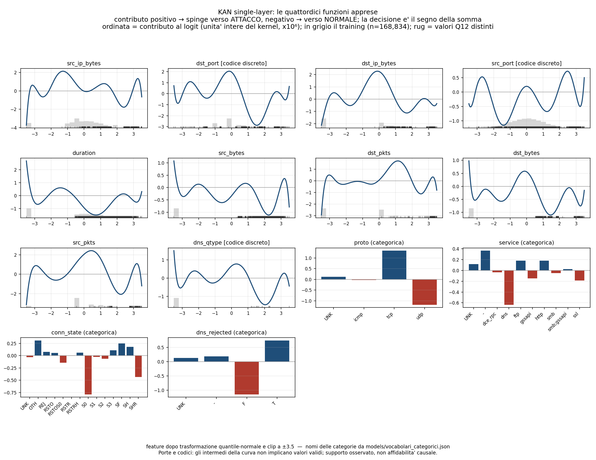
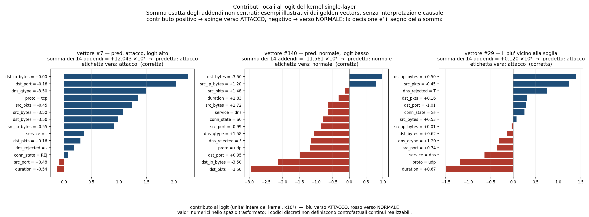

> **Paper 1 v0.15 (16 September 2026):** [accepted follow-up evidence](experiments/hardware_validation_20260916/README.md) and [artifact map](evidence/review_v015/ARTIFACT_MAP.md) integrate the pair-disjoint software study, common-500-flow board timing/energy, and observed diagnostic RAM on Mega/C3. Run `python experiments/hardware_validation_20260916/verify_evidence.py` for source-only numerical checks. Global worst-case Peak RAM and calibrated energy uncertainty are not claimed. Historical sections below retain their original scope.

> **Paper 1 review v0.12 (15 September 2026):** current [change scope](docs/REVIEW_REVISION_V012.md) and [executable evidence map](evidence/review_v012/ARTIFACT_MAP.md). The revision corrects the Q15 safety argument and MI/CIC descriptions, and adds saved-metric, signed-certificate and exact-row-overlap analyses without training or new hardware measurements. The entries below retain their stated historical scope.

> **Hardware update, 15 September 2026:** the [physical energy campaign](experiments/hardware_energy_20260915/README.md) contains 20 accepted acquisitions on Mega 2560 and ESP32-C3, native CFNs, exact firmware sources and a standard-library reproduction command. Energy is estimated at the whole-board USB input for repeated prepared-feature inference; physical peak RAM remains unmeasured. The historical entries below retain their original dates and protocols.

> **Paper 1, integrazione privata v0.9.1 (2026-09-12):** stato corrente, perimetro rispetto a `df72c7764874`, comandi verificati e limiti in [docs/INTEGRATION_20260912_IT.md](docs/INTEGRATION_20260912_IT.md). I blocchi storici sotto restano evidenza delle versioni precedenti.

# KAN-IDS: Kolmogorov–Arnold Networks for Embedded Intrusion Detection

**Compact integer KAN inference for embedded intrusion detection, with exact additive explanations for the single-layer model.**

This repository extends the published pipeline of
[*Lightweight Machine Learning Intrusion Detection for IoT/IIoT Networks*](https://doi.org/10.3390/electronics15132869)
(De Bernardis, Kuznetsov, Arnesano, Zhansaya, Sydykova — *Electronics* 2026, 15, 2869)
with a fourth model family: **Kolmogorov–Arnold Networks (KAN)** compiled for
microcontroller deployment, building on the
[`lut-kan`](https://github.com/KuznetsovKarazin/lut-kan) quantisation framework.

The saved author results below concern the **TON_IoT** network
dataset (211,043 flows). The cross-domain, joint-training and
generalization sections add **BoT-IoT**, **UNSW-NB15** and **CIC-IoT-2023**,
and each states its own protocol. Source CSVs are preserved in `results/`;
their existence does not mean the experiments have been independently rerun.

> **Historical Paper 1 finalization state, 8 September 2026 — NOT_HARDWARE_MEASURED.**
> This working copy preserves the RC3 model states and author results. The
> original snapshot and reports remain unchanged. Current evidence and open
> gates are indexed in [docs/DOCUMENT_STATUS.md](docs/DOCUMENT_STATUS.md) and
> [docs/CLAIM_EVIDENCE_MAP.csv](docs/CLAIM_EVIDENCE_MAP.csv). Fresh software
> checks belong under `artifacts/finalization/`; author CV, transfer and linker
> results must retain their provenance. At that checkpoint no new physical
> latency, energy or peak-RAM measurements were available. Host checks and Wokwi are not physical
> measurements. Hardware-ready freeze requires the exact boards, instruments,
> current toolchain builds and source/binary hashes.
>
> The common-cohort design is
> [docs/HARDWARE_COMMON_COHORT_IT.md](docs/HARDWARE_COMMON_COHORT_IT.md).
> The initial proposed measurement protocol was
> [docs/HARDWARE_ENERGY_PROTOCOL_IT.md](docs/HARDWARE_ENERGY_PROTOCOL_IT.md).
> The executed FNB58 protocol and its different energy estimator are documented
> in [the 15 September campaign](experiments/hardware_energy_20260915/README.md).
> The new `_common_` environments use a shared raw-flow cohort transformed
> with each model's fixed preprocessor; historical golden-vector environments
> are retained for functional regression. Do not use historical INA219 hook
> outputs as paper energy results. Publication, push and flashing require
> the supervisor's confirmation. `adattamento-drift/` remains Paper 2.

---

> **Author protocol v2.0 — saved CV results.** Feature selection, categorical vocabularies and
> normalisation are now fitted **inside each training fold only**
> (`kanids/preprocessing.py`, enforced by `tests/test_leakage.py`).
> In protocol v1 the mutual-information ranking that picks the 10 numeric
> features was computed on a sample of the *whole* dataset before the split,
> so feature selection could see test labels. **That regeneration is now
> complete.** Every number in the table below was re-measured under v2 with
> 5-fold × 3-seed cross-validation and comes from
> `results/cv_leakagefree_summary_*.csv`: none of it is inherited from v1.
> `results/feature_selection_stability_*.csv` reports how often each feature
> survives per-fold selection — the same 10 features in 15/15 folds, which is
> why the two protocols end up as close as they do. A v1 figure quoted
> anywhere else in this file is labelled as such, and kept only to show what
> changed.

## Headline results

| Model | Author quality result (protocol stated per row) | Model arrays | Arithmetic |
|---|---|---|---|
| Binary, single-layer + categorical edges | **F1 = 0.9835 ± 0.0007** (5-fold × 3-seed CV) | **254 B** | integer-only (int8 / Q15) |
| Binary, multi-layer (16 hidden) | **F1 = 0.9976 ± 0.0002** (5-fold × 3-seed CV) | **5.12 KB** (separate integer export-fit) | integer-only |
| Multiclass, 10 attack classes | macro-F1 = **0.9374 ± 0.0036** (5-fold × 3-seed CV) | 8.07 KB (inference) / **21.7 KB end-to-end** | integer-only, raw counters → decision |
| Symbolic form of the binary model | F1 = 0.9830 (98.47 % agreement with the network) | a printable 10-term equation + 4 lookup tables | — |

> **Sizes count the C parameter arrays consumed by the kernels**,
> not on an idealised packing: `scripts/c_footprint.py` sums the
> `static const` arrays of `mcu_pio/include/*.h`, and every figure above can
> be re-derived with `nm` on the object the compiler emits. Earlier versions
> of this table reported 246 B, 5.05 KB and 13.6 KB, produced by a counting
> rule the C code does not implement — see the size/accuracy section below,
> where the correction changes which model sits on the Pareto front.

For reference, the strongest neural baseline of the original paper — an MLP
via TensorFlow Lite Micro — reaches F1 = 0.9959 using **95 features and 13 KB**.
The multi-layer KAN here measures F1 = 0.9976 ± 0.0002 using **14 features and
5 KB**: a comparable F1 at a quarter of the size. The two figures come from
different protocols and different splits and are not paired, so the size is
the defensible part of the comparison, not the 0.0017 of F1.

> **Correction (protocol v2).** An earlier version of this table claimed that
> the 254-byte single-layer model outperforms tree ensembles "on the same
> deployable feature space". It does not. That comparison put the KAN on the
> raw 14-feature space and the baselines on the *derived* 10-feature unified
> space of the original paper — two different inputs. Re-run under v2 with
> **identical inputs for every model** (`scripts/cv_leakagefree.py`, 5-fold ×
> 3-seed), the binary ranking is:
>
> | Model | F1 | Precision | Recall | PR-AUC | FPR |
> |---|---|---|---|---|---|
> | LightGBM | **0.9991 ± 0.0001** | 0.9993 | 0.9990 | 1.0000 | 0.0023 |
> | XGBoost | 0.9989 ± 0.0001 | 0.9987 | 0.9990 | 1.0000 | 0.0041 |
> | **KAN multi-layer + categorical edges** | 0.9976 ± 0.0002 | 0.9988 | 0.9964 | 0.9999 | 0.0037 |
> | MLP (16) | 0.9964 ± 0.0009 | 0.9973 | 0.9956 | 0.9998 | 0.0088 |
> | Decision Tree (d=5) | 0.9944 ± 0.0004 | 0.9977 | 0.9913 | 0.9981 | 0.0075 |
> | KAN single-layer + categorical edges | 0.9835 ± 0.0007 | 0.9934 | 0.9738 | 0.9985 | 0.0208 |
>
> Paired descriptive differences over the 15 fold/seed fits:
>
> | Comparison | Mean ΔF1 | Fits with positive difference |
> |---|---|---|
> | multi-layer KAN − single-layer KAN | +0.0141 | 15/15 |
> | multi-layer KAN − Decision Tree (d=5) | +0.0031 | 15/15 |
> | multi-layer KAN − LightGBM | −0.0015 | 0/15 |
> | single-layer KAN − Decision Tree (d=5) | −0.0109 | 0/15 |
>
> Folds share training observations and repeated seeds reuse the dataset.
> These are descriptive statistics, not 15 independent replications; the
> earlier ordinary paired-test p-values are not used for inferential claims.
> The single-layer KAN is additive. The multilayer model permits interactions
> and has a higher saved mean F1, but this comparison also changes capacity
> and optimization. It does not isolate a causal effect of interactions.
>
> Two consequences for how this work should be framed:
>
> 1. **Against LightGBM the claim must be accuracy per byte, not accuracy.**
>    The residual gap is 0.0015 F1 (LightGBM has higher F1 in 15/15 saved fits), but 400 boosted trees are ~60 kB of parameters by a lower-bound
>    estimate — over 7× the Mega 2560's entire SRAM, so deployable only from
>    Flash, and never exported to C here — while the multi-layer KAN runs in
>    5 KB with integer-only arithmetic. (An earlier version of this line said
>    the trees "do not fit an ATmega2560 at all". That is false as stated:
>    60,400 B is 23.8 % of the board's 253,952 B of Flash. What is true is
>    that they do not fit its 8 kB of SRAM, that the only C export attempted
>    here — `mcu/lgb20_m2cgen.h`, 20 trees — does not compile for AVR, and
>    that no 400-tree firmware was ever built or measured.)
> 2. **The depth-5 decision tree wins on accuracy in-domain**, by 0.0109 F1,
>    15/15 folds. It is **not** smaller: an earlier version of this line said
>    141 B against the KAN's 250 B and concluded the single-layer KAN was
>    dominated. Those two numbers came from different accounting — the 141 B
>    was an idealised packing, the C header `mcu_pio/include/dt5_model.h`
>    stores four parallel arrays over all 57 nodes and occupies **285 B**
>    against the KAN's **254 B**. Counted the same way, on the code that
>    ships, the KAN is the smaller model and the front is a genuine
>    trade-off, not a domination — see the size/accuracy section below.

---

## What is new, and why it matters

### 1. A 14-feature space that matches 95 features
Feature-count ablation (`scripts/feature_curve_driver.py`) originally reported
a peak at exactly **10 numeric features**. The nested cross-validation added in
protocol v2 (see below) shows this is not the case: accuracy rises monotonically
up to the full 16 candidates, and k = 10 costs 0.0009 F1. **k = 10 is a
deployment choice** — 10 flow statistics to compute on-device instead of 16 —
not an accuracy optimum. The missing multiclass information turns out to be
**categorical** (`proto`, `service`, `conn_state`, `dns_rejected`): LightGBM on
10 numeric + 4 categorical features reaches macro-F1 0.9680 ± 0.0021 under
this protocol, within 0.0014 of the 0.9694 the original paper reports with all
95 features. The two numbers come from different protocols and different
splits, so this is a comparison, not a paired test: "indistinguishable" would
require a variance for the 0.9694, which that paper does not publish.
Computing 14 features instead of 95 shrinks the on-device feature set ~7× for
every model family evaluated here.

### 2. Categorical edges for KANs (novel)
KANs have no native way to consume categorical inputs; one-hot encoding wastes
polynomial bases. We introduce **tabular categorical edges**:
φ(category) = a learned table row, trained jointly by backpropagation, indexed
by category ID at inference. The cost is small because a categorical edge
*is* a lookup table: in the deployed single-layer header the four tables are
`KC_CAT[32]`, **32 bytes** of the model's 254. (An earlier version of this
line claimed 560 bytes and attributed the saving to "a LUT-compiled KAN";
neither is right — no artifact supports 560, and the LUT-compiled variant
`kan_ids_layer_int.h` has no categorical edges at all.)
Effect, under protocol v1: multiclass macro-F1 climbs 0.858 → 0.875 (single
layer) → 0.941 (with depth); binary F1 climbs 0.971 → 0.984. Those three
figures are **v1** and are kept here as the ablation that motivated the
design; the v2 values of the same models are in *Headline results* above.

### 3. Hybrid compilation: train-Chebyshev, deploy-B-spline (novel)
Chebyshev bases train more accurately; B-splines quantise more faithfully
(10× lower logit error — local support, no oscillation). We get both by
**re-fitting the learned edge functions with cubic B-splines and storing the
quantised spline coefficients** (19 per edge) instead of a sampled LUT:

<!-- tabella-compilazione:inizio -->

| Compilation | Size | ΔF1 vs float | Agreement vs float |
|---|---|---|---|
| Spline coefficients, int16 | 500 B | −0.0000 | 99.995 % |
| Spline coefficients, int8 | 278 B | −0.0006 | 99.905 % |
| Spline coefficients, int8, full-integer | **250 B** | −0.0006 | 99.905 % |

<!-- tabella-compilazione:fine -->

Those are the sizes and the losses reported by the compilation script
(`results/kan14_compile_real.csv`), which counts the coefficients, the
categorical tables and the Q15 multipliers; `tests/test_coerenza_artifact.py`
compares this table against that file cell by cell. The **deployed** header
`mcu_pio/include/kan14_coeff_int8.h` is **254 B**: it also stores the 4-byte
table of categorical offsets, which the script treats as derivable. 254 B is
the number used in the Pareto below, because it is what the compiler emits.

**Earlier versions of this table carried a fourth row — "Sampled LUT,
L = 64, 5,476 B" — and claimed the int16 form was lossless at 100.000 %.**
Neither survived checking. The lossless claim was a v1 number (420 B, on the
0.9672 model) pasted onto the v2 row; the true int16 agreement is 99.995 %.
And the LUT row came from `results/ablation_L_real.csv`, whose float baseline
is 0.9672 — a *different trained model* from the 0.9832 of the coefficient
rows, so the size ratio it implied mixed representation with retraining. The
honest version of that comparison is the sampled-LUT row of
§"Size/accuracy Pareto" below, which is sampled from the deployed header
itself and therefore changes only the representation.

Uniform (unclamped) knots give a closed matrix form per segment, evaluated
with **integer-only Horner (Q15)** — no floating point at inference.

### 4. End-to-end integer pipeline: raw counters → decision

> **Status (protocol v2).** This is now implemented and verified **in C**, not
> only simulated in Python. `scripts/export_e2e_int_c.py` emits
> `mcu_pio/include/kan_e2e_int.h` (integer tables + 200 golden vectors) and
> `mcu_pio/host_check/run_e2e_check.cpp` runs the whole chain — raw counters →
> integer features → affine segment map → int8 spline kernel → decision — in
> pure integer arithmetic. Result: **200/200 logits bit-identical** to the
> Python reference (`kanids/integer.py`), decisions identical, **1,334 B** of
> tables (an earlier version said ~822 B, counting the natural-log LUT as
> `int16`; the header declares it `int32_t[256]`, i.e. 1,024 B on its own).
> Compiling the inference path **for the ATmega2560 with `avr-g++`** and
> inspecting the emitted assembly shows **zero floating-point arithmetic and
> zero soft-float calls** — the latter being how floating point actually
> appears on a device without an FPU (`__addsf3`, `__mulsf3`, `__floatsisf`
> and relatives), which an x86-only check cannot see at all. Verified for six
> kernels: single-layer, multi-layer, 10-class, end-to-end integer, the
> depth-5 tree and the dense MLP (`tests/test_no_float_avr.py`, skipped where `avr-g++` is
> absent). The same suite includes a check of the check: a source that plainly
> uses `float` must make the script fail, and the previous x86-only regex did
> not. Two further tests fail the build if a `float` or `double` ever
> reappears in a header or a kernel. The 10-class end-to-end chain is not in
> this list: its golden-vector array exceeds AVR's limits, which is why
> `platformio.ini` builds it for the ESP32-C3 only.
>
> Two things were found while doing this. The scale multiplier of the
> highest-scale feature quantises to exactly 32768, which **overflows `int16_t`
> silently** — it is now `int32_t` (+20 B). And Python's integer division
> floors while C truncates toward zero: the two asymmetry features have signed
> numerators, so the C code implements floor division explicitly. Either bug
> would have appeared only on the device.
>
> **The 10-class chain is now in C as well.** `scripts/export_mc_e2e_int_c.py`
> emits `mcu_pio/include/kan_mc_e2e_int.h` and
> `mcu_pio/host_check/run_mc_e2e_check.cpp` runs raw counters → binary search
> over per-feature threshold tables → z in Q12 → layer-1 int8 splines +
> categorical tables → tanh LUT → layer-2 int8 splines → argmax, all in
> integers. Result: **200/200 golden vectors with all ten accumulators
> bit-identical** to the Python reference, argmax identical, macro-F1 0.9362
> against 0.9384 for the float pipeline (99.44 % argmax agreement), **21.7 KB**
> of tables. (An earlier version said 13.6 KB. The header stores the knots
> twice — `MC_KNOT` as `int64_t[1290]`, 10,320 B, plus `MC_KNOTZ` as
> `int16_t[1290]`, 2,580 B — and the earlier count included only one of the
> two. Storing both is what makes the binary search exact on the raw counters
> *and* cheap on the normalised ones; it costs 12.6 KB of the 21.7, and is the
> most obvious place to look if this variant ever has to shrink.)
>
> The same failure mode appeared a second time here: `round(tanh(x)·32768)`
> reaches exactly 32768 at the edges of the domain, overflowing `int16`. It is
> now saturated to 32767 **in the Python reference too** — saturating only on
> the device would have made reference and firmware differ by 1 LSB precisely
> on the saturated values. Q15 quantisation landing exactly on 2^15 is worth
> checking wherever it appears.
>
> Threshold tables are stored as `int64`: on TON_IoT `src_bytes` and
> `dst_bytes` reach 3.9·10⁹, past the `int32` limit. It is the byte counters
> that force 64 bits, not the duration.
>
> The earlier end-to-end path in `mcu_e2e/` is **superseded**: it interpolated
> 10,000 `QuantileTransformer` knots in **double precision**, so it was
> end-to-end in structure but not integer-only in the runtime. Kept for
> reference only.
>
> **The chain is now also deployed, not only verified.** `mcu_pio/src/main_e2e.cpp`
> is a firmware variant that takes the **raw counters** and runs the whole chain
> on the board — feature engineering included — under the paper's benchmark
> protocol (500 timed inferences, on-board statistics, SRAM). Every other
> firmware variant consumes vectors that were already normalised off-device;
> without this one the end-to-end chain would be proven correct but never
> actually run as *the* pipeline on the MCU. Build it with
> `pio run -e megaatmega2560_e2e` or `-e esp32c3_e2e`.
>
> Firmware and offline harness include the **same** kernel
> (`mcu_pio/include/kan_e2e_infer.h`), so what is verified bit-exactly is what
> runs on the board rather than a copy that can drift.
>
> *On "no floating point":* the check is on the compiled assembly of the
> inference path (`tools/check_no_float.py`, with `check_no_float.sh` as a
> shell wrapper), and it excludes FP **arithmetic**
> and int↔float conversions. The compiler does emit `pxor`/`movups` to zero the
> integer accumulator arrays in bulk; those are SIMD data moves, not FPU
> operations, and do not imply a floating-point unit on the target.

Everything between the packet counters and the decision is integer:
logarithms via a 1,024 B LUT (`int32_t[256]`, using the identity
`log1p(a/b) = ln(a+b) − ln(b)`),
integer divisions for asymmetry ratios, and the z-score/clip normalisation
**absorbed into the spline segment mapping** (two affine constants per
feature). For the multiclass model, sklearn's quantile-normal preprocessing is
replaced by **empirical per-feature threshold tables built offline from the
fitted transformer** (quantile knots + most-frequent values — exact on
discrete masses). Verified end-to-end on all 42,209 test flows: binary F1
0.9646 in **1,334 B** of model (`results/e2e_int_export.csv`); 10-class
macro-F1 **0.9362**, agreement **99.44 %**, in **21.7 KB**
(`results/mc_e2e_int_export.csv`). Earlier versions of this paragraph said
~842 B and ~11.1 KB: those figures came from a byte-counting rule that
under-counted two of three terms and from the superseded v1 protocol. The
10-class figures moved by 0.001 in the fourth revision, when the multiclass
state was retrained and **committed** so that the two headers derive from a
versioned file instead of a lost one (see *Canonical state* below).

### 5. Conformal prediction in under 1 KB
Split-conformal calibration (marginal and per-class/Mondrian) is applied
**to the deployed integer model**, so the marginal coverage guarantee holds
for what actually runs on the MCU — under the assumption that calibration and
deployment data are exchangeable. That assumption is exactly what the
cross-domain section below shows to fail in practice, and coverage under
domain shift is neither measured here nor implied by these numbers. Measured coverage under protocol v2:
**99.05 / 94.90 / 90.23 %** at targets 99 / 95 / 90 % (v1 reported
99.07 / 95.09 / 89.93 — unchanged within noise); 93.9 % of predictions are
decisive singletons at α = 0.01. On-device cost: **two float thresholds**. Uncertain flows
(two-class sets) can be escalated to a gateway — triage with a statistically
controlled error rate.

### 6. The IDS as one readable equation
Each learned edge is fitted with elementary primitives (sin, tanh, gaussian,
polynomials — weighted by the data density). The result is a 10-term printable
formula plus four small category tables, reaching **F1 0.9830** against 0.9831
for the network it approximates, with 98.47 % agreement — statistically
indistinguishable, not above it. (Protocol v1 measured 0.9835 vs 0.9832 and the
README claimed the symbolic form was *better*; re-measured under v2 the two are
simply equivalent, which is the honest and still useful claim.) See
`results/kan14_symbolic_real.txt`.

### 7. Rigour
The main results carry **5-fold × 3-seed cross-validation** (mean ± std),
and every design choice is backed by a measured alternative — see
[Negative results and design justifications](#negative-results-and-design-justifications)
below for the full list with numbers.

---

## Negative results and design justifications

Not everything we tried helped — and each null result settles a design
question that a careful reader (or reviewer) would otherwise raise. All are
measured on the full dataset, with artifacts in `results/`:

| Experiment | Result | What it settles |
|---|---|---|
| **B-spline as *training* basis** (`basis_comparison_unified_real.csv`) | F1 0.9383 vs 0.9672 for Chebyshev at equal parameter count (0.9279 with class-weighted loss — the gap is structural, not a loss artifact) | Why training uses Chebyshev, even though B-splines quantise 10× more faithfully — motivating the hybrid train/deploy split |
| **Re-fit → sampled LUT** (`protocol_v1/hybrid_compile_real.csv`) | Statistically identical to direct LUT at every resolution L (e.g. 94.54% vs 94.58% agreement at L=8) | Why the hybrid gain lives in *coefficient storage*, not in smoothing the LUT: uniform-grid sampling is the bottleneck, and re-fitting cannot remove it |
| **Doubling capacity (32 hidden units)** (`protocol_v1/ml_binary_real.csv`) | Plateau at F1 0.9778, below the 16-hidden result (0.9784), at 2× the parameters | Historical descriptive ablation; it does not establish an information limit or a current validation optimum |
| **More numeric features (k = 12–16)** (`protocol_v1/feature_curve_real.csv`) | F1 flat or slightly worse beyond k = 10, on both tasks | Why the feature space stops at 10 numeric features: additional ones add noise, not signal |
| **Lower layer-2 degree (4 vs 8)** (`protocol_v1/kan_ml_cat_deg4_real.csv`) | macro-F1 0.9374 vs 0.9409; LUT/coefficient memory does not depend on degree | Why degree 8 is kept: the cheaper variant saves nothing where it matters |
| **Focal loss (γ = 2) for the rare MITM class** (`protocol_v1/kan_ml_cat_focal_real.csv`) | macro-F1 0.9401 vs 0.9409; MITM F1 0.572 vs 0.571 | The MITM weakness is not a loss-design problem — **measured under protocol v1, not yet re-run under v2** |
| **SMOTENC oversampling (10× MITM)** (`protocol_v1/kan_ml_cat_smote_real.csv`) | macro-F1 0.9377; MITM F1 0.541 (worse than baseline) | Synthetic interpolation adds no real information — **protocol v1, not yet re-run under v2** |
| **MITM under every model** (`cv_leakagefree_summary_multiclass_real.csv`, v2) | LightGBM 0.767, XGBoost 0.761, MLP 0.386, KAN 0.270, Decision Tree 0.151 — for every model except the depth-5 tree, every other class is above 0.88 | **Independent v2 evidence pointing the same way**: no model tested exceeds 0.77, which is consistent with a limit in the feature space rather than in the architecture or the loss — though six architectures cannot establish such a limit, and the 5x spread between them shows the architecture still matters here |
| **Analytical replication of sklearn's quantile-normal transform in integer arithmetic** | Two attempts (single-sided and two-sided quantile interpolation) left errors up to 0.8σ on discrete-mass features and broke the multiclass pipeline | Why the integer preprocessing uses **empirical per-feature threshold tables sampled offline from the fitted transformer** — exact on discrete masses by construction, 3 KB total |

Two further checks worth knowing about: the accelerated training path used
for large experiments is proven identical to the reference implementation to
machine precision (max coefficient difference 2·10⁻¹⁶ after 60 epochs), and
the focal-loss gradient was verified against numerical differentiation
(max error < 10⁻⁹) before use.

## Repository structure

```
kan-ids/
├── reproduce.py            single entry point: `python reproduce.py --list`
├── kanids/                 leakage-free core — the only place that learns from data
│   ├── config.py                   paths, seeds, feature space (single source of truth)
│   ├── preprocessing.py            fit-on-train feature selection + encoding + scaling
│   ├── splits.py                   5-fold × 3-seed protocol, shared by every model
│   ├── models.py                   KAN with categorical edges + baselines, one interface
│   ├── metrics.py                  F1/PR-AUC/confusion matrices, mean ± std aggregation
│   ├── datasets.py                 TON_IoT loader + synthetic generator for smoke tests
│   └── cache.py                    artifact cache with automatic invalidation
├── tests/                  leakage and reproducibility tests (pytest)
├── tools/                  maintenance scripts (e.g. /tmp → artifacts/ migration)
├── artifacts/              intermediate caches — regenerated, gitignored, never /tmp
├── src/                    KAN model implementations (NumPy)
│   ├── kan_chebyshev.py            single-layer Chebyshev KAN (binary)
│   ├── kan_chebyshev_multiclass.py softmax multiclass variant
│   ├── kan_bspline.py              B-spline KAN + basis utilities
│   ├── kan_multilayer_numpy.py     multi-layer forward (verification)
│   └── quantization_export.py, embedded_model_io.py, fixed_point_quantile.py
├── preprocessing/          unified 10-feature engineering (from the paper)
├── scripts/                every experiment, one script each (see index below)
├── results/                artefatti CSV/TXT che sostengono ogni numero sopra
│   └── protocol_v1/              risultati pre-correzione, conservati e marcati
├── mcu_pio/                PlatformIO firmware (Arduino Mega 2560 + ESP32-C3)
│   ├── src/main.cpp              variant 1–2: sampled-LUT inference benchmark
│   ├── src/main_coeff.cpp        variant 3: spline-coefficient full-integer
│   ├── include/                  model headers + 200 real test vectors
│   └── host_check/               offline g++ verification harness
├── models/                 trained model weights (.npz) — ready to compile/test
├── mcu/, mcu_e2e/          earlier firmware experiments (Wokwi, kept for reference)
├── data/                   dataset download instructions (data not redistributed)
└── utils.py                shared models/metrics (from the published pipeline)
```

### Script index

**Training** — `kan14_binary.py` (14-feature binary + categorical edges),
`kan14_ml_binary.py` (multi-layer binary), `kan_categorical_mc.py` /
`kan_ml_cat_mc.py` (multiclass with categorical edges), `cv_multiseed.py` +
`cv_driver.py` and `kan14_cv_driver.py` (cross-validation).

**Compilation & deployment** — `export_lut.py` / `export_lut_fast.py`
(sampled LUT), `hybrid_coeff_full.py` and `kan14_compile.py` /
`kan14_ml_compile.py` (spline-coefficient compilation, int16/int8),
`coeff_int_inference.py` (full-integer kernel), `e2e_int_pipeline.py` and
`kan14_mc_e2e_int.py` (end-to-end integer pipelines),
`export_kan14_coeff_c.py` (C header generation for the firmware).

**Analysis & ablations** — `feature_curve_driver.py`, `ablation_L.py`,
`basis_comparison_unified.py`, `quant_basis_comparison.py`,
`hybrid_compile.py`, `kan_ml_cat_focal.py`, `kan_ml_cat_smote.py`,
`kan_ml_cat_deg.py`, `conformal_ids.py` / `kan14_conformal_symbolic.py`,
`symbolic_extract.py`.

**Cross-domain & joint training** — `cross_domain.py` (four TON_IoT ↔
BoT-IoT experiments) and `crossdomain_report.py` (tables + shift analysis);
`joint_training.py` (TON_IoT + BoT-IoT trained together at matched
size/ratio, evaluated separately on each and, with `--eval-extra unsw`, on
UNSW-NB15 without retraining).

Long-running scripts (`*_driver.py`, `kan*_ml_*.py`) are **checkpointed**:
they save state after each unit/epoch chunk and can be re-invoked until they
print `DONE` — convenient on shared or time-limited machines.

---

## Getting started

```bash
git clone https://github.com/emanuelepiodebernardis/kan-ids-v2.git
cd kan-ids
pip install -r requirements.txt          # everything needed to reproduce
# or, to reproduce the published numbers with the exact versions they were measured with:
pip install -r requirements-lock.txt
git clone https://github.com/KuznetsovKarazin/lut-kan.git   # OPTIONAL: legacy LUT export scripts only
```

**Two environments, cross-checked.** The revision pass that produced v2.1-rc
ran on Python 3.13.2 with numpy 2.3.4, scipy 1.16.2, lightgbm 4.6.0 and
pyarrow 23.0.1 — five packages and a Python minor apart from the lock. Every
artifact regenerated under it came out **identical**: both C headers byte for
byte, `dt5_export.csv` and `e2e_int_export.csv` unchanged, every bit-exact host
check still 200/200. Exactly one number moved: the XGBoost *estimate* in
`results/footprint.csv`, 49,905 → 50,120 B (+0.43 %), as the ensemble grew
from 9,921 to 9,964 internal nodes. Those two figures come from that run and
were not written to any artifact, so they cannot be re-derived from this
repository — they are reported as an observation, not as a result. xgboost is
the same 3.2.0 in both environments, which leaves the preprocessing libraries
as the plausible source; **no experiment here isolates the variable**, and
five packages plus a Python minor changed together. F1 does not move
(0.9989 ± 0.0001 either way). The committed value is the locked
environment's; nothing in this repository rests on it, since it is a lower
bound for a model never exported to C.

`requirements.txt` is complete on its own — xgboost, lightgbm and the parquet
engine are declared there. `requirements-lock.txt` pins the exact versions
used for the published results, and `tests/test_ambiente.py` fails if the two
files ever disagree. (They did: the lock pinned a pytest that violated the
declared bound, three needed packages were only in the lock — including
`pyarrow`, without which the cross-domain and joint-training blocks stop at
the first parquet cache — and two declared packages were needed by nothing.)

**Pre-trained models.** `models/` holds the versioned training checkpoints of
the headline models plus `feature_space.npz` and a `MANIFEST.json` recording
the protocol version, the seeds, the selected feature space and the measured
metrics (`scripts/export_models.py` regenerates it). The **deployable**
artifacts are the C headers in `mcu_pio/include/`, and those are what make the
next sentence true: you can compile and verify every host check **without the
dataset and without retraining**. The dataset is only needed to reproduce
training and the evaluation tables.

`artifacts/` and `models/` are not the same thing: `artifacts/` is regenerable
cache, gitignored, wiped by `reproduce.py --stage clean`; `models/` is
versioned. **The multiclass multi-layer checkpoint is committed**, as
`models/kan14_multiclass_multilayer.pkl` (41,507 B), and the two 10-class C
headers are re-emitted from it byte for byte — see *Canonical state* below.
Until v2.1-rc3 it was not, and this paragraph said so; that sentence outlived
the file it described by one commit, which is the reason `MANIFEST.json` now
records `versionato` per checkpoint and a test asks **git**, not the
filesystem, whether each one is really tracked.

**Dataset.** Download `train_test_network.csv` (TON_IoT, UNSW Canberra —
see `data/README.md`) and place it in the repository root. It is not
redistributed here.

**Reproduce:**

```bash
# 1. smoke test — no download needed, ~1 minute
#    runs the whole chain on synthetic data with the TON_IoT schema
#    and executes the leakage / reproducibility test suite
python reproduce.py --stage smoke

# 2. the real experiments (needs data/train_test_network.csv)
python reproduce.py --list          # what each stage does
python reproduce.py --stage cv-binary        # 5-fold × 3-seed, KAN + all baselines
python reproduce.py --stage cv-multiclass
python reproduce.py --stage all              # everything, in dependency order

python reproduce.py --stage clean            # wipe artifacts/ and start over
```

**Where each headline table comes from.** No table in this README is
assembled by hand any more; each is written by a stage, and the test suite
fails if the README and the artifact disagree.

| Table | Stage | Artifact |
|---|---|---|
| Bytes / accuracy Pareto front | `footprint` | `results/footprint.csv` |
| Cross-domain degradation, 4 directions | `crossdomain` | `results/crossdomain_degradation.csv` |
| Paired significance between models | `crossdomain` | `results/crossdomain_significativita.csv` |
| Final 7-column table | `joint` then `tabelle` | `results/tabella_finale.csv` |
| Integer C headers, 10 classes | `multiclass-state`, `export_models.py`, then `integer-10classi` | `mcu_pio/include/kan14_mc_coeff_int8.h`, `kan_mc_e2e_int.h` |

**Canonical state: the two 10-class C headers now derive from a versioned
file.** Until the third revision they were *frozen artifacts*: exported from
`artifacts/mlcat_state.pkl`, a trained state that is not versioned (it is an
optimiser state) and that had been lost. They were verified bit-exactly by the
host checks, but their **provenance** could not be reproduced: retraining
gives an equivalent, not identical, model. The training is full-batch with a
fixed `RandomState(0)` and no shuffling, so it is deterministic *as an
algorithm*; it is not deterministic *in floating point*, because BLAS
reduction order depends on thread count and library version and 300 Adam
epochs amplify the last bits enough to move the decision on one sample of the
smallest class. Retraining it produced

| | lost state (until rc2) | retrained and committed (rc3) |
|---|---|---|
| macro-F1 | 0.9378 | **0.9384** |
| weighted F1 | 0.9803 | 0.9803 |
| parameters | 3,392 | 3,392 |

The 0.0006 gap is one or two MITM samples out of 208 changing side — MITM
carries 0.49 % of the test set, which is why the weighted F1 does not move at
all.

That retrained state is now **committed**, as
`models/kan14_multiclass_multilayer.pkl`, and the two headers were re-exported
from it: `kan14_mc_coeff_int8.h` (integer-simulation macro-F1 0.9388 measured
at export) and `kan_mc_e2e_int.h` (macro-F1 0.9362, 99.44 % argmax agreement).
The difference this makes is not cosmetic. A frozen artifact is the only copy
of something lost; these are now the deterministic function of a versioned
file, and `tests/test_stato_multiclasse.py` re-runs the export and compares
the result **byte for byte**. Both headers say so in their own first lines,
and name the command that regenerates them.

`multiclass-state` and `integer-10classi` stay deliberately **outside**
`--stage all`, for two now-distinct reasons: retraining produces *another*
state rather than the same one, and re-exporting rewrites two deployment
artifacts through a LAPACK least-squares whose last digit can depend on the
installed version. Whether that export really is deterministic is checked
where a failure is informative — in that test — not inside a routine
reproduction, where it would be a silent substitution.

The `joint` stage runs three commands and their order is not
interchangeable: the first picks the attack:normal ratio looking **only** at
a validation split carved out of the training set, and only then do the two
evaluation commands touch the test sets, once.

Every run prints the seeds, the library versions and the validation protocol
before doing anything, so an experiment log contains all that is needed to
repeat it. Individual scripts remain runnable on their own:

```bash
python scripts/cv_leakagefree.py --task binary --models KAN,LightGBM
python scripts/kan14_compile.py                   # 250 B full-integer (254 B nell'header C)
python scripts/c_footprint.py --verbose            # byte contati sugli header compilati
python scripts/kan14_mc_e2e_int.py                # raw counters → 10 classes
```

Intermediate caches and training checkpoints are written to `artifacts/`
inside the repository (override with `KANIDS_ARTIFACTS`). Nothing is written
to `/tmp`, so a clean clone behaves identically on Linux, macOS and Windows,
and a cache produced by an older pipeline version is detected and rebuilt
instead of being silently reused.

---

## Experimental protocol

One protocol for every model, so that the comparison table is a comparison
and not a collection of differently-measured numbers.

| Item | Choice | Why |
|---|---|---|
| Validation | `StratifiedKFold(5, shuffle=True)` repeated over **seeds 42, 43, 44** → 15 fits per model, reported as mean ± std | A single split cannot separate a real gap from fold noise; 3 seeds expose seed sensitivity |
| Stratification | always on the **10-class** label, even for the binary task | Binary and multiclass models then see byte-identical folds, and the rare MITM class is present in every fold |
| Feature selection | mutual information, computed **inside each training fold** | In v1 this ran once on a sample of the whole dataset — test labels leaked into the choice of features |
| Categorical encoding | vocabulary built from the **training fold**; index 0 reserved for unseen categories (UNK) | Fixes the v1 leak (vocabulary built on train+test) and makes the categorical edge a *total* function — required for cross-domain, where the target dataset has protocol/state values absent from the source |
| Numeric scaling | `log1p` on skewed features → `QuantileTransformer(normal)` → clip to ±3.5, **fitted on the training fold** | Unchanged from v1, which was already correct; now explicit and covered by tests |
| Held-out | 20 % stratified, never touched during selection or tuning | Only used for the final reported number |

Seeds live in `kanids/config.py` (`SEEDS = (42, 43, 44)`) and are printed by
every run. `kanids.set_global_seed()` fixes `random`, `numpy` and `torch`.

This protocol covers the **in-domain tables on the raw 14-feature space** —
the binary and multiclass comparisons above. The cross-domain and
joint-training experiments live on the harmonised 13+2-feature space and run
at **10 seeds** throughout; they are a separate family of runs and their own
section states the counts. The two are never averaged together.

### How leakage-freedom is enforced

`kanids/preprocessing.py` has exactly one rule: `fit()` sees only the training
split, `transform()` never receives `y`. Four tests hold it in place:

| Test | What it would catch |
|---|---|
| `test_transform_is_row_independent` | any statistic recomputed inside `transform` (a re-fitted scaler, a rebuilt vocabulary) |
| `test_fit_depends_only_on_training_rows` | corrupting the test rows must not change the fitted preprocessor at all |
| `test_permuted_labels_give_chance_performance` | reproduces the v1 defect: with random labels, pre-split selection scores **AUC 0.521 ± 0.033**, per-fold selection stays at **0.499 ± 0.027** |
| `test_unseen_category_maps_to_unk` | an unseen category must land in the UNK slot, in range for the on-device table lookup |

`tests/test_reproducibility.py` additionally fails the build on any hard-coded
`/tmp` path, any absolute user path, unpinned requirements, or a missing
`reproduce.py` stage — the properties of point 6 are checked, not just claimed.

The measured effect of the v1 leak on a *real* dataset is expected to be small
(the ranking is stable: see `results/feature_selection_stability_*.csv`), but
"small" is a measurement, not an assumption, and the protocol has to be
defensible independently of how large the effect turns out to be.

---

## Is the reported estimate independent? A measurement, not an argument

Repeated CV summarizes performance on this dataset. The historical pipeline
choices and the nested feature-count experiment have different estimands.
`scripts/nested_cv.py` reselects k from {5, 8, 10, 12, 14, 16} inside outer
training folds, while the flat comparison fixes k = 10. The difference mixes
feature-count choice with evaluation design and does not isolate selection
optimism or certify that earlier data exposure had negligible effect.

| Model | Nested (selection inside the loop) | Flat (k fixed at 10) | Flat minus nested | k chosen by the inner CV |
|---|---|---|---|---|
| KAN single-layer | 0.9845 ± 0.0006 | 0.9835 | **−0.0009** | 16 in **15/15** folds |
| LightGBM | 0.9992 ± 0.0001 | 0.9991 | **−0.0001** | 16 in 11/15, 14 in 3, 12 in 1 |

The nested procedure has higher mean F1 for these two models. This is not
a bound on selection bias, and it does not validate width, degree or clip.

**What the measurement does overturn is a different claim.** The inner
selection never picks k = 10; it picks the full set of 16 candidates in 15/15
folds for the KAN. The averaged inner curve is monotone, not peaked:

| k | 5 | 8 | 10 | 12 | 14 | 16 |
|---|---|---|---|---|---|---|
| KAN single-layer | 0.9795 | 0.9809 | 0.9836 | 0.9839 | 0.9841 | **0.9845** |
| LightGBM | 0.9984 | 0.9989 | 0.9990 | 0.9991 | 0.9991 | **0.9991** |

So the earlier statement that "accuracy peaks at exactly 10 numeric features"
does not survive the corrected protocol. Accuracy keeps creeping up with more
features; it simply stops mattering. **k = 10 is a deployment decision, not an
accuracy-optimal one**, and now it has a price tag: it costs **0.0009 F1** for
the KAN and **0.0001** for LightGBM, in exchange for computing 10 flow
statistics on the device instead of 16. That is the honest way to state it,
and it is a better argument than a peak that is not there.

Width 16, degree 8 and clip ±3.5 are inherited choices. Historical ablations
under `results/protocol_v1/` used a held-out split later reported as an outcome.
The new work does not erase that exposure or claim a previously untouched
test set. See the separate validation architecture comparison below.

Reproduce with:

```bash
python scripts/nested_cv.py --task binary --models "KAN(cat,1L)|LightGBM"
```

### Architecture: selected and deployed are not the same

`scripts/select_architettura.py` re-runs the width/degree choice where it
belongs: on a validation split carved **inside** the training set, five seeds,
the test set computed and never read. The rule was fixed in the script's
docstring *before* the numbers existed — the 1-SE rule: among configurations
whose mean is within one standard error of the best, take the smallest.

The result does not confirm the deployed architecture:

| | hidden | degree | bal. acc. (validation) | parameters |
|---|---|---|---|---|
| selected by the rule | 32 | 6 | **0.99631** | 2,592 |
| same mean, larger | 32 | 8 | 0.99631 | 3,296 |
| **deployed** | **16** | **8** | **0.99602** | **1,648** |

The top two configurations have the same reported validation mean to six
decimals. The rule's threshold, read from
`results/arch_selection_scelta.json`, is **0.99617**: the best mean 0.99631
minus one standard error of 0.00014 over five seeds. The 1-SE rule therefore
selects **32 / 6**, the smaller of the two configurations at or above that
threshold; the deployed **16 / 8**, at 0.99602, falls **0.00015** below it and
is a deployment preference, not the architecture the rule selects. Note that
the threshold uses the standard error, not the standard deviation: with the
standard deviation in its place 16 / 8 would appear to qualify, which is the
mistake this sentence now states the number to prevent.

Each seed generates its own validation split, shared by all the candidates
compared within that seed; the five seeds therefore describe training and
split variability together, not repeated draws on one fixed partition.
Non-significance is not equivalence.

**The project keeps 16 / 8, and that is not a result of the selection.**
Nothing in this repository claims the architecture was selected on validation
— it was inherited from phase 1. What the selection contributes is the *price*
of that inheritance, and on a reviewer's request that price is now **compiled
and measured** rather than asserted (`scripts/footprint_architettura.py`,
`results/arch_footprint.csv`):

| | model bytes | kernel stack | kernel code | bal. acc. (validation) |
|---|---|---|---|---|
| selected — 32 / 6 | 9,452 | 219 | 2,130 | 0.99631 |
| **deployed — 16 / 8** | **5,244** | **155** | **1,916** | **0.99602** |
| difference | **+4,208 (+80.2 %)** | +64 (+41 %) | +214 | +0.00028 |

Both configurations were trained with the protocol of the selection and
compiled with the same procedure as the deployed header
(`kanids/compila_ml.py`, shared so that the comparison is between two
architectures and not between two compilers). The deployed arm reproduces the
5,244 B of the committed header exactly — that is what makes the two rows
comparable with `results/footprint.csv`. Bytes are counted twice, by this
project's parser and by the sections `avr-g++` emits for the ATmega2560, and
the two agree. The h = 32 model was **not** evaluated on the test set, then or
now: its accuracy figures are the selection's, on validation, over five seeds.

The cost in *compiled* bytes (+80 %) is larger than the cost in Chebyshev
parameters (+57 %), and the difference is not an accident: after compilation
to B-splines every learned function is 19 coefficients whatever the degree of
the polynomial it came from, so the footprint follows the hidden width and
ignores the degree. An earlier version of this section quoted the parameter
figure as though it were the footprint.

The saved author compilation comparison shows 80% more model-array Flash for
32 / 6 and a validation mean difference of about 0.00028. Both parameter
arrays fit within the boards' Flash capacities. The saved kernel stack values
are compiler estimates for those artifacts, not measured peak device RAM.
Keeping 16 / 8 is a deliberate resource preference with a descriptive accuracy
trade-off, not a hard capacity limit or an optimality claim.

Two limits of this selection, stated for the same reason the ratio's are:

- the single-layer degree (8) **is** confirmed, but it sits at the edge of the
  grid {4, 6, 8} with a monotone increasing curve (0.9704 → 0.9736 → 0.9773):
  a higher degree might do better and no experiment here checks it;
- `hidden = 32` is likewise the largest width tried. The rule picked the
  boundary, which is exactly the situation where the grid, not the data, is
  answering.

`results/arch_selection.csv` holds all twelve configurations,
`arch_selection_scelta.json` the rule and the paired comparisons.

Reproduce with:

```bash
python scripts/select_architettura.py --seeds 42,43,44,45,46
```

---

## Multiclass (10 attack classes), 5-fold × 3 seed

Same protocol, same feature space, same folds as the binary task.

| Model | Macro-F1 | Weighted-F1 | Macro-P | Macro-R | PR-AUC | F1 MITM |
|---|---|---|---|---|---|---|
| LightGBM | **0.9680 ± 0.0021** | 0.9903 | 0.9589 | 0.9807 | 0.9850 | 0.767 |
| XGBoost | 0.9666 ± 0.0021 | 0.9893 | 0.9608 | 0.9737 | 0.9834 | 0.761 |
| **KAN multi-layer + cat** | **0.9374 ± 0.0036** | 0.9803 | 0.9246 | 0.9738 | 0.9629 | 0.541 |
| MLP (16) | 0.9182 ± 0.0107 | 0.9758 | 0.9253 | 0.9151 | 0.9373 | 0.386 |
| KAN single-layer + cat | 0.8767 ± 0.0014 | 0.9424 | 0.8759 | 0.9295 | 0.9106 | 0.270 |
| Decision Tree (d=5) | 0.7633 ± 0.0033 | 0.8245 | 0.7829 | 0.7864 | 0.7351 | 0.151 |

Paired over the 15 identical folds:

| Comparison | Δ Macro-F1 | Folds won | p |
|---|---|---|---|
| multi-layer − single-layer | **+0.0608** | 15/15 | 1.6e−19 |
| multi-layer − Decision Tree (d=5) | **+0.1741** | 15/15 | 5.0e−23 |
| multi-layer − MLP (16) | **+0.0192** | 14/15 | 1.1e−05 |
| multi-layer − LightGBM | **−0.0306** | 0/15 | 5.8e−15 |

Two things the 10-class task shows that the binary one hides:

1. **Depth matters four times more here.** The multi-layer KAN gains +0.0608 macro-F1
   over the single-layer, against +0.0141 F1 on the binary task. Separating attack
   *families* needs feature interactions far more than separating attack from normal
   does — which is the same structural argument, with a much larger effect size.
2. **The depth-5 tree collapses.** It was the most accurate model on the binary
   task (285 B, F1 0.9944); here it is last by a wide margin, 0.1741 macro-F1
   below the multi-layer KAN. Its in-domain advantage was specific to the binary
   problem and does not survive the harder task.

**MITM is where every model bottoms out.** With 1,043 flows (0.49 %), no model
gets far on it — LightGBM 0.767, KAN multi-layer 0.541, MLP 0.386, KAN single-layer
0.270, Decision Tree 0.151 — while every other class is above 0.88 for every model
except the depth-5 tree, which also drops ddos to 0.635 and xss to 0.649. Neither class
weighting, focal loss nor SMOTENC moved it. That is consistent with a limit in the
information this feature space carries, but it does not establish one: six
architectures do not exhaust the space of architectures, and the spread across
them here (0.15 to 0.77, a factor of five) is larger than on any other class,
which is itself evidence that the architecture still matters a great deal on
MITM. What can be said is that this is where six architectures land, not what is
achievable. The multi-layer KAN doubles the single-layer's MITM F1 (0.541 vs
0.270), which is where most of its macro-F1 advantage comes from.

---

## Size/accuracy Pareto: what the 254-byte claim actually buys

Counting every model with the **same rule** settles the comparison the earlier
claim left open — but only if the rule is the one the code implements. It was
not. Until this revision `scripts/footprint.py` counted bytes under an
idealised packing (internal node = 4 B, leaf = 1 B), which the C tree does not
use: `mcu_pio/include/dt5_model.h` stores four parallel arrays over all 57
nodes, leaves included, and occupies 285 B rather than 141. The rule now reads
the headers PlatformIO compiles (`scripts/c_footprint.py`), and the correction
is not cosmetic: it **reverses the size ordering** of the two smallest models.

| Model | Bytes | Input | Rule | F1 (TON_IoT, 5×3 CV) | Bal. acc. TON→BoT | Structure |
|---|---|---|---|---|---|---|
| **KAN single-layer + cat** | **254** | preprocessed | compiled | 0.9835 ± 0.0007 | **0.5573** | int8 spline coeffs + 4 tables |
| Decision Tree (d=5) | 285 | preprocessed Q7 | compiled | **0.9944 ± 0.0004** | 0.5494 | 4 arrays × 57 nodes |
| MLP (16) | 760 | preprocessed | compiled | 0.9964 ± 0.0009 | 0.4369 | int8 weights + categorical table + int32 biases |
| KAN e2e integer (binary) | 1,334 | raw counters | compiled | — | — | raw counters → decision, all tables |
| KAN single-layer, sampled-LUT | 20,554 | preprocessed | compiled | — | — | same 10 learned functions, 1,025 int16 samples each; train-calibration freeze |
| **KAN multi-layer + cat** | **5,244** | preprocessed | compiled | **0.9976 ± 0.0002** | 0.4588 | int8, two spline layers |
| KAN multiclass (10 classes) | 8,268 | preprocessed | compiled | — | — | int8, two layers, 10 outputs |
| KAN LUT integer (default env) | 10,248 | z-scored | compiled | — | — | int16 lookup table, 10 × 512 |
| KAN e2e integer (10 classes) | 22,264 | raw counters | compiled | — | — | raw values → argmax, knots stored twice |
| XGBoost | 49,905 | preprocessed | *estimate* | 0.9989 ± 0.0001 | 0.5528 | 300 trees, 9,921 nodes |
| LightGBM | 60,400 | preprocessed | *estimate* | 0.9991 ± 0.0001 | 0.4779 | 400 trees, 12,000 nodes |

> **Historical sampled-LUT result (RC3, test-informed L = 257).** The
> The former 5,194-byte row and `results/lut_vs_coeff.csv` /
> `results/lut_vs_coeff_test.csv` describe the author variant.
> Its grid was chosen using the minimum coefficient logit margin among 200
> test-derived vectors. This is test-informed representation selection. The
> saved agreement on 42,209 test flows is historical empirical evidence and
> does not retroactively make the selection independent of test.
>
> The corrected selection retains the learned coefficient functions and uses
> all 168,834 training-derived calibration rows. The fixed candidate grid ends
> at L=1025: no candidate certifies every training decision, so the documented
> fallback selects L=1025, **20,554 B** (about **80.9×** the coefficient arrays).
> B=4,271 and minimum |training logit|=336: 168,800 rows are bound-certified,
> 34 are not; empirical training agreement is 168,834/168,834. These 34 rows
> are not observed mismatches. See `results/lut_selection_protocol.json` and
> `results/lut_vs_coeff_calibration.csv`. Test agreement is evaluated after
> this freeze in `results/lut_vs_coeff_postfreeze_test.csv` with provenance in
> `results/lut_postfreeze_test_protocol.json`: all 42,209 test decisions agree,
> both F1 values are 0.9825844106941132, and four rows fall outside the sufficient
> margin condition (no observed flips). Maximum observed logit deviation is 1,262. The historic 20.4× ratio does
> not describe the current header.
>
> For the bound B = sum of per-edge maximum deviations over all admissible
> Q12 inputs, a coefficient decision is preserved when |logit| > B, provided
> categorical terms agree and integer arithmetic has no overflow. This is a
> conditional decision-agreement guarantee, not classification correctness or
> a guarantee for every future input. Full-test agreement is empirical and is
> evaluated after the representation is frozen.

> **The `Input` column is the second thing the table has to say, and it used
> to say nothing.** 254 B and 1,334 B are not two prices for the same job. The
> single-layer KAN receives **ten numeric features already quantile-normalised,
> clipped and quantised to Q12, plus four categorical codes**: the transform
> that produces them runs off the device, its parameters are not in those 254 B,
> and neither is the code that applies them. The end-to-end chain receives
> **raw counters** — bytes, packets, duration — and does the whole feature
> engineering on board: its 1,334 B include the ln lookup, the affine
> constants and the quantisation that the 254 B model gets for free from
> somebody else. Read down the column before reading across the row: the
> comparison that means something is 254 B vs 285 B vs 760 B vs 20,554 B (all
> `preprocessed`), or 1,334 B vs 22,264 B (both `raw counters`). The `z-scored`
> row is a third case again, from the older paper model.

**The two rules are not interchangeable, and the table says which applies
where.** "Compiled" is a measurement: the sum of the `static const` arrays in
the header, reproducible with `nm` on the emitted object. "Estimate" is a
lower bound for the two models never exported to C — XGBoost and LightGBM —
so a model that appears to be beaten on size by an estimated row has not been
proven to be.

The MLP row moved from *estimate* to *compiled* during the second review, and
the number moved with it: 705 B estimated at one byte per parameter, 760 B
measured on `mcu_pio/include/mlp16_int8.h`. The 55 B are the first-layer
biases, kept in int32, and the categorical table into which the 32 one-hot
design columns are compiled. This is the same kind of gap the tree showed
(141 B estimated, 285 B measured), in the same direction: the estimate is
always the optimistic one.

**In-domain the single-layer KAN is no longer dominated; counted on
parameter bytes it is the smallest model on the front.** The depth-5 tree is still more accurate (0.9944 vs
0.9835) and is monotone-invariant, so it needs no preprocessing at all, and
the KAN's end-to-end integer chain costs 1,334 B once the feature engineering
is included. The front is a real trade-off across its whole range — 31 bytes
buys 0.011 F1 at the bottom, 49,600 bytes buys 0.0045 more at the top — rather
than a domination. What does **not** follow from this correction is that
"accuracy per byte" is vindicated: 31 bytes is a rounding error on either
board, and the argument the repository makes for the single-layer model still
rests on cross-domain behaviour, not on size.

Three things survive, and they are what the line of work should be built on:

1. **The multi-layer KAN sits on the frontier.** 5.2 KB and F1 0.9976, against
   the original paper's TensorFlow Lite Micro MLP at 13 KB and 0.9959 using 95
   features — smaller, more accurate, and 14 features instead of 95.
2. **Cross-domain the ranking does not follow the in-domain one.** The
   single-layer KAN is in the top group on TON→BoT (0.5573 balanced accuracy)
   together with XGBoost and the depth-5 tree, from which it is not
   statistically separable — see the head-group test below. The depth-5 tree
   is the worst of all in the BoT→TON direction (0.4597). LightGBM, first
   in-domain, drops to fourth of six on TON→BoT (0.4779) while staying second
   on BoT→TON (0.6964): its in-domain lead does not carry over, but it is not
   the worst transferring model in either direction. On TON→BoT the additive
   model has the smallest degradation (δ = 0.413), though not separably from
   XGBoost or the tree; on BoT→TON it is fifth of six. Graceful degradation
   is a property of one direction of this pair, not of the architecture.
3. **The KAN offers what a tree does not**: split-conformal calibration applied
   to the deployed integer model, a closed symbolic form, and — because the
   whole model is rewritable lookup tables — the possibility of on-device
   recalibration, which is precisely the follow-up the cross-domain collapse
   motivates.


Not measured here: **latency**, which depends on toolchain and target and
requires the physical benchmark on the Mega 2560 and ESP32-C3.
`scripts/footprint.py` produces the size axis only.

**Code size and SRAM, however, are now measurable without the boards**, by
building the firmware with the AVR toolchain and reading `avr-size`. Doing so
found a defect the parameter count hides: `dt5_model.h`, `kan_e2e_int.h`,
`kan_mc_e2e_int.h` and `test_vectors.h` were declared without `PROGMEM`, so on
AVR their tables landed in **SRAM** instead of Flash — 6,286 B for the tree
firmware and 7,334 B for the end-to-end one, against the Mega 2560's 8 KB
total. Both would have failed on the bench, not in the table. See the firmware
section for the fix and the current figures.

---

## Cross-domain: TON_IoT ↔ BoT-IoT

Binary task (normal vs attack) on a **harmonised 13-feature space** built with
the *same formula* on both datasets (`kanids/harmonized.py`): flow duration,
IP-level bytes and packets per direction, their totals, asymmetries, mean
payloads and rates, plus protocol and connection state mapped into a common
semantic alphabet. Ports and addresses are excluded — they are testbed
identifiers — as are BoT-IoT's windowed aggregates, which have no TON_IoT
counterpart and assume global state an MCU does not keep.

In the cross-domain runs the target domain is used **only** for evaluation:
feature selection, quantiles, categorical vocabularies and thresholds are all
fitted on the source. Unseen target categories fall into the UNK slot, whose
rate is reported.

That constraint is **enforced by a test, not asserted in prose**
(`tests/test_leakage.py::test_crossdomain_target_does_not_influence_training`).
The pipeline is fitted twice on the same source with two radically different
targets — one rescaled by 5,000 and carrying categories that never occur in the
source — and the test requires that everything learned is byte-identical: the
selected features, the categorical vocabularies and cardinalities, the fitted
quantiles, and the transform of a third fixed probe set. Injecting the classic
violation (fitting the preprocessor on source ∪ target) makes it fail, which is
how we know it is not vacuous.

| Experiment | Train | Test | Runs |
|---|---|---|---|
| training and test on TON_IoT | 168,834 | 42,209 | 50 per model |
| training and test on BoT-IoT | 19,431–19,482 | 733,704–733,705 | 50 per model |
| training on TON_IoT, test on BoT-IoT | 211,043 (all) | 3,668,522 (all) | 10 seeds |
| training on BoT-IoT, test on TON_IoT | 24,327 | 211,043 (all) | 10 seeds |

The two cross directions consume the target whole, so there are no folds there
by construction and the dispersion reported is between seeds. **All four
experiments are on one protocol: 10 seeds**, with 5 folds on top for the two
in-domain ones. The in-domain BoT-IoT and both cross directions were raised
from 3 seeds to 10 to close a gap flagged during an internal audit — the
cross-domain claims were resting on 3 repetitions against 15 for in-domain,
and a follow-up project on the same data (`adattamento-drift/`, see below) had
already shown that 3-seed samples on these exact directions can mislead.
TON→TON was raised last, and only for uniformity: at 3 seeds it was already
the most stable column in the table, and going to 10 moved no model by more
than 0.0006 balanced accuracy. That is worth stating, because it says the
opposite of the BoT-IoT case — where the seed count mattered, the numbers
moved; here they did not, and now nobody has to wonder which columns are
comparable.

**Metric note.** BoT-IoT is 99.987 % attack. Under that prior PR-AUC on the
positive class is ~1 by construction and says nothing: the TON→BoT runs show
PR-AUC 0.9999 despite weak balanced accuracy. The honest metrics are the two
per-class recalls and their mean (balanced accuracy), reported below.

### Balanced accuracy (mean of the two per-class recalls; reference 0.50)

| Model | TON in-domain | TON→BoT | δ | BoT in-domain | BoT→TON | δ |
|---|---|---|---|---|---|---|
| **KAN multi-layer** | 0.9932 | 0.4588 | 0.534 | 0.9971 | 0.6855 | 0.312 |
| **MLP (16)** | 0.9879 | **0.4369** | **0.551** | 0.9426 | 0.7343 | 0.208 |
| LightGBM | 0.9963 | 0.4779 | 0.518 | 0.9971 | 0.6964 | 0.301 |
| XGBoost | 0.9947 | 0.5528 | 0.442 | 0.9779 | 0.6487 | 0.329 |
| Decision Tree (d=5) | 0.9828 | 0.5494 | 0.433 | 0.9952 | 0.4597 | **0.536** |
| **KAN single-layer** | 0.9701 | **0.5573** | **0.413** | 0.9934 | 0.6112 | 0.382 |

Every cell is on the 10-seed protocol; `results/crossdomain_degradation.csv`
is the artifact behind it and is regenerated by `scripts/crossdomain_report.py`
from the run-level CSV, so the two cannot drift apart unnoticed again.

TON→BoT mean balanced accuracy ranges from 0.4369 to 0.5573. The
single-layer KAN has the highest mean in this fixed direction; XGBoost and
the shallow tree have nearby means. In BoT→TON the ranking differs. This is
an observed reversal, not a general superiority or causal capacity claim.

**Descriptive pairwise differences, TON→BoT.** Read from
`results/crossdomain_significativita.csv`, with the single-layer KAN as the
reference and the sign in its favour. Against MLP(16) the gap is **0.1205**,
against the multi-layer KAN **0.0985**, against LightGBM **0.0795**, against
the depth-five tree **0.0079**, against XGBoost **0.0046**. These are
differences of means over ten retraining seeds, reported because they are
descriptive: the last two are of the same order as the seed-to-seed spread,
and no pairwise test here licenses a ranking claim.

The evaluation sets are fixed across all ten seeds — **211,043** TON_IoT flows
and **3,668,522** BoT-IoT flows, the whole of each — so the paired statistic
measures variability of retraining on fixed data, not generalization to new
data. This is also why the Nadeau–Bengio correction does not apply here, as
the artifact records in its own `correzione` column.

The ten cross-domain seeds reuse the same source and target observations.
They measure training stochasticity, not ten independently sampled networks.
Author paired-test artifacts are retained for provenance; their p-values do
not establish generalization across domains, and failure to reject a
pairwise difference does not establish model equivalence. Balanced accuracy
0.5 is the label-independent reference, not a statistical test of chance.

### Why it degrades

The marginals barely overlap. Per-feature histogram overlap between the two
domains (0 = disjoint, 1 = identical), `results/crossdomain_shift.csv`:

| Feature | median TON | median BoT | overlap |
|---|---|---|---|
| byte_rate | 544 217.7 | 32.4 | **0.085** |
| duration | 0.000 | 15.509 | **0.106** |
| bytes_total | 172 | 600 | 0.153 |
| pkt_asymmetry | 0.000 | 0.857 | 0.162 |
| flow_rate | 7 978.7 | 0.404 | 0.178 |

TON_IoT flows are short and bidirectional; BoT-IoT's 5 % subset is dominated by
long unidirectional UDP floods (`pkts_dst` median 0, `byte_asymmetry` 0.998).
The connection state confirms it: BoT-IoT is 78 % `incomplete` + 21 % `reset`,
TON_IoT spreads across all six states. 21.3 % of TON_IoT rows carry a state
never seen when training on BoT-IoT; in the other direction the rate is ~0.

The harmonised categorical edges usually help, but **not uniformly, and the
earlier version of this paragraph overstated it.** It claimed removing them
"costs 0.08–0.16 balanced accuracy cross-domain". Across the eleven measured
cross-domain (model, direction) cells the effect runs from **−0.2519 to
+0.1859**, and in two of them removing the categorical edges *helps*: MLP (16)
on TON→BoT gains 0.25, and the depth-5 tree on BoT→TON gains 0.03. The quoted
range was not a rounding of the real one — it excluded the two cells that
contradict it.

What survives is a weaker and true statement: in 9 of 11 cross-domain cells
the semantic state mapping carries transferable information, and in-domain it
helps in all 11 of them (+0.004 to +0.108) — 11 and not 12 because
KAN(cat,ML) has no `nocat` in-domain run to compare against. The MLP exception is the largest
single effect in either direction and is not explained here; the same model is
also flagged elsewhere in this README as the least stable of the six.

Two caveats on this ablation, since they bound how much weight it can take.
The `nocat` runs are still at **3 seeds** for the cross directions while the
`cat` runs are at 10, so each delta mixes two sampling protocols. And
`KAN(cat,ML)` has no `nocat` run on TON→BoT at all, which is why eleven cells
are measured and not twelve (`results/crossdomain_table.csv`, variant
`nocat`).

Reproduce with:

```bash
python scripts/cross_domain.py --exp all          # 4 experiments
python scripts/cross_domain.py --exp all --no-cat # numeric-only ablation
python scripts/crossdomain_report.py              # tables + shift analysis
```

---

## Joint training: TON_IoT + BoT-IoT together, tested on a third domain

Cross-domain shows what happens training on one domain and testing on
another. The complementary question is what happens training on **both at
once**, with matched contribution from each — and whether whatever it learns
survives contact with a domain it has never seen at all.

### The constraint that limits everything here

The request was a joint training set with the same total size and, as far as
possible, the same normal/attack ratio contributed by each domain. Both
constraints together are bounded by BoT-IoT: 477 normal flows total, ~382 of
them inside its own 80% training split — three orders of magnitude fewer than
TON_IoT's ~40,000. `balance_joint()` (`scripts/joint_training.py`) enforces
this: it splits train/test **inside each domain first**, then caps both
domains' normal count at the smaller of the two (always BoT-IoT's), then caps
attacks at `ratio × normals` in both, **then** concatenates — feature
selection, preprocessing and model fitting only ever see the union. This
order is enforced by a test
(`tests/test_joint_training.py::test_joint_training_test_set_does_not_influence_training`),
built the same way as the cross-domain one: fit the same joint training set
twice against radically different held-out test pairs and require the
learned preprocessor to be byte-identical.

### Choosing the ratio: on validation, once

The attack:normal ratio inside each domain's contribution is not given by the
problem — it has to be chosen. It is chosen on a **validation set carved out
of the training set**, never on the test sets, and the test sets are then
evaluated once at the chosen value.

`scripts/joint_training.py --select-ratio` splits each domain's training
pool into fit (80 %) and validation (20 %), stratified by the same function
that produces the outer held-out. For each candidate ratio it balances only
the fit part, unions the two domains, fits all six models and scores them on
the two validation sets — which keep their natural class distribution, the
same condition the test sets are in. The winner is the highest mean balanced
accuracy over 6 models × 2 domains × 10 seeds:

The unit of analysis is the **seed**: the criterion is already a mean over
models and domains, so the mean is taken first and ten paired observations
remain. An earlier version of this table listed 120 "pairs" — 10 seeds × 6
models × 2 domains in one list — which inflates the degrees of freedom
twelvefold without adding information, and produced p-values down to 10⁻⁸.

| ratio | bal. acc. on validation (10 seeds) | vs 1:5 | 1:5 wins in |
|---|---|---|---|
| **1:5** | **0.97320 ± 0.00405** | — | — |
| 1:10 | 0.97020 ± 0.00488 | −0.00300 | 10/10 |
| 1:20 | 0.96566 ± 0.00639 | −0.00753 | 10/10 |
| 1:50 | 0.95920 ± 0.00603 | −0.01400 | 10/10 |
| 1:100 | 0.95230 ± 0.00421 | −0.02090 | 10/10 |

The declared mean validation criterion selects 1:5. Win counts and dispersion
summarize these saved training runs on fixed validation datasets; they do not
provide independent domain replications. This correction does not erase the
historical test-set ratio exploration documented below.

One claim retracted here. An earlier version read "the dispersion grows with
the ratio — 0.0228 at 1:5, 0.0563 at 1:100 — so higher ratios are also less
repeatable". Those figures were the spread over all 120 measurements, which
mixes two different things. Decomposed: **between seeds** the dispersion does
not grow (0.00405 → 0.00488 → 0.00639 → 0.00603 → 0.00421, not monotone);
**between models and domains** it does (0.0221 → 0.0234 → 0.0270 → 0.0410 →
0.0566). So a high ratio does not make a run less repeatable — it makes the
six models *disagree more with one another*. Different statement, and the
one the data supports.

Artifacts: `results/joint_ratio_selection.csv`,
`results/joint_ratio_significativita.csv`,
`results/joint_ratio_vittorie.csv` (per model × domain × candidate),
`results/joint_ratio_selection_scelta.json`.

> **Correction (this is the second review).** An earlier version chose 1:5
> by watching how the models degraded on **TON_test and BoT_test** as the
> ratio grew. That consumed the test sets five times instead of once, and
> selected the ratio on the very quantity then reported as the result. The
> conclusion happens to be the same — 1:5 either way — but the previous
> route to it was not admissible. The old test-set grid is kept, clearly
> labelled, in `results/griglia_su_test_superata/`; it is not a current
> result. Three tests now make the test sets unable to re-enter the choice:
> replacing every row destined for the test set does not move the
> validation, nor the balanced training sets of any of the five candidates,
> by a single index
> (`tests/test_joint_training.py::test_ratio_selection_ignores_the_test_sets_entirely`).

Four things about that grid need to be stated, not left implicit:

- **The ratio confounds two variables.** Normals are pinned at ~382 in every
  cell; only the attack count changes, so a lower ratio means a training set
  that is *both* more balanced *and* smaller (1:5 → 2,292 rows/domain; 1:100
  → 38,582). The result — lower ratio wins — cannot separate "balance
  matters" from "size matters", and nothing here attempts to. What it does
  show is that ~17× more data at 1:100 does not buy the accuracy back.
- **1:5 sits at the edge of the searched grid.** The candidates are
  {5, 10, 20, 50, 100} and the curve is monotone decreasing, so the best
  point measured is the smallest one tried: a lower ratio may well be
  better, and no experiment here rules that out. 1:5 is reported as the best
  point *measured*, not as an optimum.
- **The floor was not pushed to 1:1.** At 1:1 each domain would contribute
  ~764 rows, and this exact regime — BoT-IoT-derived extreme rebalancing —
  is where a companion project on the same data (`adattamento-drift/`) has
  documented a **different** failure mode: label selection for adaptation
  becomes unreliable before the model itself does.
- **MLP (16) is the least repeatable model in this grid.** Across ratios and
  validation domains its seed-to-seed standard deviation reaches **0.0589**,
  against 0.0136 for the next worst (KAN single-layer) and 0.0079 for the
  most stable (LightGBM) — a factor of 4.3 over the runner-up. Read its
  numbers throughout this section with that reservation.
  `results/joint_ratio_dispersione.csv` has the per-model, per-domain,
  per-ratio breakdown.

Checkpoints and per-run values are in
`results/joint_ratio_selection_runs.csv`; the evaluation at the chosen ratio
is in `results/joint_training_*_ratio5_cat.csv`.

### Generalization to UNSW-NB15, frozen, no retraining

The joint model (features, preprocessing, architecture and hyperparameters,
all frozen at fit time) is evaluated on UNSW-NB15 exactly as fitted — same
call, one more test dataframe, never touched by training, selection or
balancing (`--eval-extra unsw` in `scripts/joint_training.py`).

**Before reading that number: UNSW-NB15 is a hard target in this feature
space even without any transfer.** A useful in-domain reference point:
trained and tested only on itself, in the same 13+2-feature harmonised
space, a single-layer KAN reaches **0.8184 ± 0.0020 balanced accuracy**
against ~0.97 on TON_IoT and ~0.99 on BoT-IoT. Much of UNSW-NB15's
discriminative power lives in 38 features this space excludes by
construction (the same exclusions applied to TON_IoT/BoT-IoT, for the same
reasons), so part of any TON+BoT→UNSW gap is the target domain being harder
here, not the joint model having learned nothing.

**What 0.8184 is not.** It is not a ceiling, and it is not a bound the
transfer numbers can be measured against:

- it is **one model with one decision threshold**, not the best achievable
  in this space. The same run's ROC-AUC is **0.9285**: the features separate
  the two classes considerably better than 0.8184 suggests, and a
  differently calibrated threshold would move the number without changing
  the model. A quantity that a threshold can move is not a ceiling;
- it is not measured under this project's protocol. It comes from the
  companion project on drift adaptation
  (`adattamento-drift/RISULTATI.md`, section 11), which uses its own
  training-set construction and its own model selection. It is quoted here
  as an order of magnitude, and the two protocols are not interchangeable;
- consequently, nothing here licenses the statement that a
  TON+BoT→UNSW result *cannot* exceed 0.8184. An earlier version of this
  section said exactly that. It was wrong: no experiment in this repository
  establishes an upper bound on UNSW-NB15 in this feature space, and none
  was run.

### The final table, one protocol throughout

| Model | TON→TON | BoT→BoT | TON→BoT | BoT→TON | TON+BoT→TON | TON+BoT→BoT | TON+BoT→UNSW |
|---|---|---|---|---|---|---|---|
| LightGBM | 0.9963 | 0.9971 | 0.4779 | 0.6964 | 0.9846 | 0.9951 | 0.3884 |
| XGBoost | 0.9947 | 0.9779 | 0.5528 | 0.6487 | 0.9804 | 0.9925 | 0.4193 |
| KAN multi-layer | 0.9932 | 0.9971 | 0.4588 | 0.6855 | 0.9811 | 0.9924 | 0.3629 |
| Decision Tree (d=5) | 0.9828 | 0.9952 | 0.5494 | 0.4597 | 0.9669 | 0.9865 | 0.4081 |
| MLP (16) | 0.9879 | 0.9426 | 0.4369 | 0.7343 | 0.9296 | 0.9494 | 0.3119 |
| KAN single-layer | 0.9701 | 0.9934 | 0.5573 | 0.6112 | 0.9432 | 0.9825 | 0.3991 |

All entries are balanced accuracy, and the heading is now literal: **every
column is 10 seeds**, with 5 folds on top wherever a fold structure exists
(TON→TON and BoT→BoT). The two cross directions consume the target whole; the
three joint columns are at the ratio-5 configuration chosen above. Reading it
in order:

- **Joint training roughly matches single-domain in-domain performance on
  both domains it was trained on, and even improves it for two models on
  one domain.** TON+BoT→TON costs 0.012–0.059 balanced accuracy versus
  TON→TON (worst case MLP, best case LightGBM/KAN multi-layer); on BoT,
  TON+BoT→BoT costs at most 0.011 (KAN single-layer) and **improves on
  BoT→BoT for two models** — XGBoost by 0.015, MLP by 0.007. Pooling the two
  training sets at matched size/ratio does not cost much on either domain
  for any of the six models, and for a third of them it is a net win on BoT.
- **TON+BoT→UNSW sits at 0.31–0.42, below the entire range of the pairwise
  cross-domain numbers** (0.44–0.73): a domain the joint model never saw any
  part of transfers worse than one domain transferring to the other. Part of
  that gap is UNSW-NB15 being a harder target in this space to begin with
  (in-domain reference 0.8184, against ~0.97–0.99 for TON_IoT/BoT-IoT), but
  the reference is not a bound and the residual cannot be attributed
  quantitatively without an in-domain UNSW baseline measured under this
  project's own protocol, which was not run.
- Cross-domain rankings among the six models are **not** preserved in the
  joint-training columns: Decision Tree is the worst BoT→TON performer
  (0.4597) but the second-best TON+BoT→UNSW performer (0.4081, behind only
  XGBoost). Joint training and cross-domain transfer are different regimes
  and one does not predict the other from this table alone.

Reproduce with:

```bash
python scripts/joint_training.py --ratio 5                    # main config
python scripts/joint_training.py --ratio 5 --eval-extra unsw   # + UNSW-NB15
python scripts/joint_training.py --ratio 10   # sensitivity, also 20/50/100
```

---

## A fourth dataset, in a smaller space: CIC-IoT-2023

Requested by name. CIC-IoT-2023 does not report directional counts — no
`src_bytes`/`dst_bytes`, no `src_pkts`/`dst_pkts`, no connection state — so
seven of the thirteen rich-space numeric features (both asymmetries, both
mean payloads, all four directional counts) cannot be built for it. What
survives in all four datasets is six numeric features (duration, total
bytes, total packets, mean payload, flow rate, byte rate) plus the same two
categorical edges: a **6+2** space, not the 3+2 an earlier pass through this
data mistakenly concluded — that mistake mattered, because it also flagged
`flow_duration` as unusable, and `test.csv` (the file actually used here)
has a genuine one: median 26.1 s for benign flows against 0.0 s for attacks,
correlation with the (separately corrupted) `IAT` column of 0.008. `Duration`
is the TTL and is not used; `flow_duration` is not `Duration`.

**Verified, not assumed, that no missing feature is filled with an invented
value.** `build_ridotto_cic()` (`kanids/harmonized.py`) raises `KeyError` if
`flow_duration`, `Number` or `Tot sum` are absent rather than defaulting —
confirmed by running it against the actual file: all three are present, and
so are the TCP flag columns (`rst_count`, `fin_count`, `syn_count`,
`ack_count`) used to reconstruct connection state. Loaded whole, `test.csv`
gives a non-degenerate `state_h` (44% incomplete, 42% reset, 8% other, 6%
closed) and `proto_h` (67% TCP, 16% UDP, 11% ICMP, 6% other) — if the flag
columns had been absent, the fallback path would have collapsed `state_h` to
100% "incomplete", which is not what is observed.

### The cost of the reduction — measured on domains that don't need it

The same TON_IoT+BoT-IoT joint model (ratio 1:5, 10 seeds) was refit in the
6+2 space and re-evaluated on TON_test, BoT_test and UNSW-NB15, so the
reduction's cost is measured on the three domains already analysed in the
rich space. These are observed differences on fixed datasets; model fits also
change. In CIC the unit of observation differs from the source flow logs.

| Model | Δ TON (rich−reduced) | Δ BoT | Δ UNSW |
|---|---|---|---|
| KAN single-layer | −0.0054 | +0.0021 | −0.0755 |
| KAN multi-layer | +0.0008 | −0.0026 | −0.0592 |
| LightGBM | +0.0027 | −0.0010 | −0.0590 |
| XGBoost | +0.0011 | 0.0000 | −0.0302 |
| Decision Tree (d=5) | 0.0000 | −0.0062 | −0.0286 |
| MLP (16) | +0.0361 | +0.0037 | +0.0029 |

Positive values favor the rich space. Directions vary by model and domain;
0.0361 balanced accuracy is not assumed negligible. These differences do not
identify a causal feature mechanism or establish equivalence where means are
close. UNSW and CIC are external stress tests already explored in the project
history, not newly untouched discovery sets.

### CIC-IoT-2023 itself

| Model | Balanced accuracy |
|---|---|
| XGBoost | 0.5099 |
| KAN multi-layer | 0.5002 |
| LightGBM | 0.4928 |
| KAN single-layer | 0.4974 |
| MLP (16) | 0.4725 |
| Decision Tree (d=5) | 0.4144 |

Near chance for every model, and in the same range as TON+BoT→UNSW
re-measured in this same reduced space (0.31–0.47) — the two hardest targets
in this document sit close together once both are looked at in the same
6+2 space, below most of the pairwise TON↔BoT cross-domain numbers (0.44–0.73)
but not all of them (the worst pairwise cell, MLP on TON→BoT at 0.4369, falls
inside CIC's own range). This is not a contradiction of the companion project's
finding that CIC-IoT-2023 "is not a severe transfer benchmark" — that finding
was about single-domain cross-domain transfer *into* CIC-IoT-2023, in a
different space, with adaptation. Zero-shot from a joint TON+BoT model,
un-adapted, is a different question, and the answer here is that it
transfers poorly. The two results are about different pipelines and are not
in tension.

CIC-IoT-2023's rows are also a different unit of observation from the other
three datasets — sliding windows of packets, not bidirectional flows — which
this space does not correct for and which is a more likely explanation for
the near-chance result than the feature reduction itself (whose measured
cost, above, is small or favorable).

Reproduce with:

```bash
python scripts/joint_training.py --ratio 5 --spazio ridotto --eval-extra unsw,cic
```

---

## Interpretability: the explanation *is* the computation

The deployed single-layer kernel
(`mcu_pio/include/kan14_coeff_infer.h`) computes exactly this and nothing
else:

```
logit =  Σ_i  ((acc_i · KC_MULT[i]) >> 15)                 10 numeric edges
      +  Σ_j  (KC_CAT[off_j + c_j] · KC_CAT_MULT[j] · 6)    4 categorical edges
```

The fourteen addends are the exact arithmetic decomposition of this fixed
single-layer kernel. They explain its computation, not causal effects or
feasible changes to a network flow. Additive functions can be shifted by
constants with a compensating intercept; uncentered terms do not define a
unique feature-importance ranking.

`tests/test_interpretabilita.py` checks the sum against the compiled C kernel
on the saved verification vectors. Fresh logs, training support distributions,
row IDs and labels are identified in `results/interpretabilita_provenance.json`;
the fresh run logs are in `artifacts/finalization/xai_validation/`. The original
200-vector CSVs remain in the immutable snapshot, while current XAI CSVs are
regenerated with the documented training-support distinction. Library dependencies are not evidence of
interpretability. SHAP implementations have different assumptions and may
compute exact quantities for supported model classes; SHAP and saliency
methods are not generally local-surrogate fitting procedures.

### The fourteen learned functions



Ten spline edges over the numeric features (after the quantile-normal
transform and the ±3.5 clip) and four lookup tables over the categorical
ones, slot 0 being the never-seen-in-training `UNK`. The ordinate is the
contribution to the logit in the kernel's integer units, and the sign
convention is printed on the figure itself: **positive pushes toward
*attack*, negative toward *normal*, and the decision is the sign of the
sum**.

The current figure uses all 168,834 training rows for the support histograms
and a deterministic train rug. The 200 balanced verification flows are
separately labeled where shown; they are not the training distribution. Semantic category names
come from the frozen vocabulary; missing vocabulary must be stated explicitly.
Ports and numeric category codes such as `dns_qtype` are discrete values:
interpolation between their codes is a computational extension, not a physical
continuous relation.

**Read the values, not the wiggles.** The curves oscillate: degree 8 with no
smoothness penalty, compiled to 16 B-spline segments, and nothing in the
training objective rewards monotone or simple shapes. For a *given input* the
contribution is exact, and that is what the local explanations below use. The
shape *between* the training density's modes is not evidence of a domain law,
and this README does not read it as one.

### Three real flows, decomposed



A confident attack, a confident normal flow, and the vector closest to the
decision threshold. The third is the interesting one: its logit is
+0.12·10⁶ — about one per cent of the confident case — and it is the residue
of terms pulling in opposite directions, with `duration` and `proto` pushing
toward *normal* and `dst_ip_bytes`, `src_pkts`, `dns_rejected` toward
*attack*. A model that only emitted a score would say "attack, barely". The decomposition identifies the signed arithmetic terms in this decision;
it does not certify that changing them independently is feasible.

Each panel states the model's **predicted** label and the flow's **true**
label, and marks the pair as correct or wrong. This matters: the figure
explains the decision the model took, which is a different thing from the
right answer, and without both labels a reader takes the explanation as a
justification. The numbers are in
`results/interpretabilita_contributi.csv`, including the row where the
addends are summed, the row with the resulting decision and the row with the
true label.

### How much each edge can move the logit

| edge | min | max | range |
|---|---|---|---|
| src_ip_bytes | -3.74 | +2.12 | **5.86** |
| src_pkts | -3.15 | +2.42 | **5.58** |
| dst_port | -2.86 | +2.04 | **4.90** |
| dst_pkts | -2.93 | +1.71 | **4.64** |
| dst_ip_bytes | -2.14 | +2.25 | **4.39** |

The table uses all 168,834 training rows, in units of 10⁶. Values come from
`results/interpretabilita_escursione.csv`. This is an observed range of each
additive term, not an estimated feature-importance ranking.

### The multi-layer does not decompose this way, and we do not pretend it does

For `KAN(cat,ML)` the second layer mixes hidden units, so this particular
exact per-input additive decomposition is unavailable. Conditional slices or
other attribution methods would answer different questions and require their
own assumptions. The saved CV mean is higher, but direct single-layer XAI
does not extend automatically to the multilayer model.

Reproduce with:

```bash
python scripts/interpretabilita.py
```

---

## A companion project: adaptation to domain drift

`adattamento-drift/` is a separate, self-contained project living at the
repository root, built on the same TON_IoT/BoT-IoT/UNSW-NB15 harmonised
feature space as the cross-domain work above but developed and reported
independently (its own `kanids/`, `scripts/`, `RISULTATI.md`, README). It
asks the question this cross-domain section's degradation implies: *given
that a model trained on one domain fails on another, can it be adapted back
to usable accuracy with a small, embedded-feasible label budget?* It is not
integrated into `reproduce.py` or this README's tables, and is not required
to reproduce anything above — see `adattamento-drift/README.md` for what it
contains and how to run it.

---

## What can actually be flashed

Every exported model has a firmware and a PlatformIO environment, so each one
can be measured on the two boards under the same benchmark protocol:

| Model | Firmware | Environment | Input |
|---|---|---|---|
| KAN LUT integer | `main.cpp` | `megaatmega2560`, `esp32c3` | z-scored vectors |
| KAN single-layer, spline coeffs | `main_coeff.cpp` | `*_coeff` | pre-normalised vectors |
| **KAN single-layer, sampled-LUT** | `main_lut14.cpp` | `*_lut14` | pre-normalised vectors |
| KAN multi-layer | `main_mlcoeff.cpp` | `*_mlcoeff` | pre-normalised vectors |
| KAN multiclass | `main_mc.cpp` | `esp32c3_mc` | pre-normalised vectors |
| **KAN end-to-end, binary** | `main_e2e.cpp` | `*_e2e` | **raw counters** |
| **KAN end-to-end, 10 classes** | `main_mc_e2e.cpp` | `esp32c3_mc_e2e` | **raw values** |
| **Decision Tree d=5** | `main_dt5.cpp` | `*_dt5` | same feature space as the KAN |
| **MLP(16) dense** | `main_mlp.cpp` | `*_mlp` | same feature space as the KAN |
| Common-cohort latency replay | `main_common_latency.cpp` | `*_common_*` | prepared-feature boundary, one model per build |
| Energy harness (all of the above) | `main_energy.cpp` | `*_energy*` | as the variant it measures |

`tests/test_firmware_size.py` requires this table to name **every**
`mcu_pio/src/main_*.cpp` and every environment it cites to exist in
`platformio.ini`. It was added because the table had silently fallen behind
twice: it was missing `main_mlp.cpp` and `main_lut14.cpp` — the dense baseline
and the sampled-LUT — while both were built, measured and listed elsewhere in
this file.

**Two variants exist only for the ESP32-C3**, `esp32c3_mc` and
`esp32c3_mc_e2e` (and with them `esp32c3_energy_mc`). This is a gap, not a
limit: both 10-class headers are entirely `PROGMEM`, so on AVR their tables
would sit in Flash — 8,268 B and 22,264 B out of the Mega's 253,952 B — and
`main_mc.cpp` compiles for the ATmega2560. They were simply never given a Mega
environment, and the honest statement is that the 10-class results on the Mega
2560 have not been measured, rather than that they cannot be.

The Decision Tree exists for a specific reason: the depth-5 tree is the model that
most threatens the premise of this work, being more accurate in-domain than the
compiled single-layer KAN, and without a firmware that comparison could not be
closed on the device. On parameter bytes it occupies 285 B against the KAN's
254 B — the two are within 12 % of each other, so the tree's case rests on
accuracy, not on size. Quantising its thresholds to Q7 for the device costs it
0.0028 F1 (0.9944 → 0.9916, 99.55 % agreement with the float model), which
narrows the gap to the compiled KAN from 0.0109 to 0.0081 — still in the
tree's favour.

---

## Firmware

`mcu_pio/` is a PlatformIO project targeting the two boards of the original
paper — **Arduino Mega 2560** (AVR, 8 KB SRAM) and **ESP32-C3** (RISC-V) —
implementing the same benchmark protocol (500 timed inferences: 250 attack +
250 normal, on-board statistics, prediction verification, SRAM report,
CSV over serial):

```bash
cd mcu_pio
pio run -e megaatmega2560_coeff   -t upload   # KAN single-layer,   254 B
pio run -e megaatmega2560_dt5     -t upload   # Decision Tree d=5,  285 B
pio run -e megaatmega2560_mlp     -t upload   # MLP(16) dense,      760 B
pio run -e megaatmega2560_e2e     -t upload   # end-to-end binary,  1,334 B
pio run -e megaatmega2560_lut14   -t upload   # sampled-LUT,       20,554 B; current calibration choice
pio run -e megaatmega2560_mlcoeff -t upload   # KAN multi-layer,    5,244 B
pio run -e megaatmega2560         -t upload   # KAN-LUT integer,    10,248 B
pio run -e esp32c3_mc             -t upload   # 10 classes,         8,268 B
pio run -e esp32c3_mc_e2e         -t upload   # 10 classes e2e,     22,264 B
pio device monitor --baud 115200
```

Replace the `megaatmega2560` prefix with `esp32c3` for the other board; the
energy variants are the same names with `_energy` after the prefix, and are
listed with their measured Flash and SRAM in *Flash and SRAM per variant*
below. The bytes in the comments are **model** bytes from
`results/footprint.csv`, not the size of the flashed binary.

Every variant embeds **real test vectors with expected predictions** from
the bit-exact reference simulation, so on-board correctness is verified
automatically at every run.

Without hardware, the exact inference kernels can be verified on any host:

```bash
cd mcu_pio
g++ -O2 -o c1 host_check/run_coeff_check.cpp    && ./c1   # binary 254 B:  200/200
g++ -O2 -o c2 host_check/run_ml_coeff_check.cpp && ./c2   # multi-layer:   200/200
g++ -O2 -o c3 host_check/run_mc_coeff_check.cpp && ./c3   # multiclass:    200/200
g++ -O2 -o c4 host_check/run_e2e_check.cpp      && ./c4   # e2e binary:    200/200
g++ -O2 -o c5 host_check/run_mc_e2e_check.cpp   && ./c5   # e2e 10 classes:200/200
g++ -O2 -o c6 host_check/run_mlp_check.cpp      && ./c6   # dense MLP(16):  200/200
g++ -O2 -o c7 host_check/run_host_check.cpp     && ./c7   # LUT variant:   39/40
```

The first six compare the C kernel against the **Python reference**, golden
vector by golden vector, and are bit-exact. The seventh is a different kind of
check and is listed separately for that reason: it compares the LUT variant's
predictions against the **ground-truth labels** of 40 real flows, and the one
mismatch is a borderline normal the model itself gets wrong — present in the
float variant too, so a model error rather than a quantisation artifact. It is
not a bit-exactness result and should not be quoted as one.

The C kernel in `include/kan14_coeff_infer.h` is a line-by-line translation of
the bit-exact NumPy integer simulation and matches it on 200/200 real test
vectors in the saved author checks. The optional INA219 hook is historical
and must not supply article energy values; use the external marker protocol.

### Historical author RC3 Flash and static SRAM build sizes

<!-- firmware-size:inizio -->

The author saved 29 RC3 PlatformIO linker results. These are **compiled binary sizes**, Arduino core included, not proof that a board was flashed or measured; they are written to `results/firmware_size.csv` by `scripts/firmware_size.py`, which also regenerates this block. They are a different quantity from the *model* bytes in the Pareto table above, which count only the parameter arrays.

The remaining 20 environments in `mcu_pio/platformio.ini` have no verified build yet and are listed in `results/firmware_size_pending.csv`, with no sizes copied from any other configuration. Of those, 10 are energy environments whose physical measurement is also still missing: not compiled and not measured are recorded as two separate states, because compiling them would not complete the second.

**Mega 2560** — 8,192 B SRAM, 253,952 B Flash

| Environment | Use | Flash | SRAM | of SRAM |
|---|---|---|---|---|
| `megaatmega2560_energy` | energy | 14,000 B | 701 B | 8.6 % |
| `megaatmega2560_energy_dt5` | energy | 13,978 B | 777 B | 9.5 % |
| `megaatmega2560_energy_e2e` | energy | 21,008 B | 617 B | 7.5 % |
| `megaatmega2560_energy_lut14` | energy | 18,394 B | 701 B | 8.6 % |
| `megaatmega2560_energy_mlcoeff` | energy | 19,968 B | 701 B | 8.6 % |
| `megaatmega2560_energy_mlp` | energy | 13,974 B | 701 B | 8.6 % |
| `megaatmega2560` | latency | 19,408 B | 298 B | 3.6 % |
| `megaatmega2560_coeff` | latency | 12,036 B | 208 B | 2.5 % |
| `megaatmega2560_dt5` | latency | 11,662 B | 204 B | 2.5 % |
| `megaatmega2560_e2e` | latency | 17,964 B | 204 B | 2.5 % |
| `megaatmega2560_lut14` | latency | 16,430 B | 208 B | 2.5 % |
| `megaatmega2560_mlcoeff` | latency | 18,000 B | 208 B | 2.5 % |
| `megaatmega2560_mlp` | latency | 12,010 B | 208 B | 2.5 % |

**ESP32-C3** — 327,680 B SRAM, 1,310,720 B Flash

| Environment | Use | Flash | SRAM | of SRAM |
|---|---|---|---|---|
| `esp32c3_energy` | energy | 268,132 B | 14,500 B | 4.4 % |
| `esp32c3_energy_dt5` | energy | 268,808 B | 14,580 B | 4.4 % |
| `esp32c3_energy_e2e` | energy | 273,366 B | 14,420 B | 4.4 % |
| `esp32c3_energy_lut14` | energy | 272,952 B | 14,500 B | 4.4 % |
| `esp32c3_energy_mc` | energy | 276,538 B | 14,500 B | 4.4 % |
| `esp32c3_energy_mlcoeff` | energy | 273,444 B | 14,500 B | 4.4 % |
| `esp32c3_energy_mlp` | energy | 268,494 B | 14,500 B | 4.4 % |
| `esp32c3` | latency | 263,778 B | 13,828 B | 4.2 % |
| `esp32c3_coeff` | latency | 255,768 B | 13,748 B | 4.2 % |
| `esp32c3_dt5` | latency | 256,166 B | 13,748 B | 4.2 % |
| `esp32c3_e2e` | latency | 260,804 B | 13,748 B | 4.2 % |
| `esp32c3_lut14` | latency | 260,576 B | 13,748 B | 4.2 % |
| `esp32c3_mc` | latency | 264,140 B | 13,748 B | 4.2 % |
| `esp32c3_mc_e2e` | latency | 309,026 B | 13,748 B | 4.2 % |
| `esp32c3_mlcoeff` | latency | 261,074 B | 13,748 B | 4.2 % |
| `esp32c3_mlp` | latency | 256,122 B | 13,748 B | 4.2 % |

<!-- firmware-size:fine -->

On the ESP32-C3 the SRAM figure is dominated by the Arduino core and barely
moves between variants, which is the useful observation: on that board the
*model* is not what constrains memory. On the Mega it is, and that is where
the next paragraph matters.

> This table used to be written by hand and said *"All twelve PlatformIO
> environments build"*, listing twelve rows. The environments had become
> twenty-nine, and the table still listed twelve — silently omitting half the
> firmware, including every energy variant, which are exactly the ones being
> measured on the boards. It is now generated from a real build.

#### The defect this exposed

Four headers — `dt5_model.h`, `kan_e2e_int.h`, `kan_mc_e2e_int.h` and
`test_vectors.h` — carried no `PROGMEM` qualifier, so on AVR their tables were
emitted into `.data`: copied into **SRAM** at startup instead of being read
from Flash in place. Both states were built with PlatformIO, so the comparison
is like-for-like on the toolchain that will be used on the bench:

| Environment | SRAM before | SRAM after | Flash before | Flash after |
|---|---|---|---|---|
| `megaatmega2560_dt5` | **6,488 B — 79.2 %** | 204 B — 2.5 % | 11,642 B | 11,662 B |
| `megaatmega2560_e2e` | **7,538 B — 92.0 %** | 204 B — 2.5 % | 17,820 B | 17,964 B |

At 92 % of the Mega 2560's 8,192 bytes there is nothing left for the stack.
Those static allocations left little SRAM for the stack and created a
plausible runtime-failure risk. A linker result alone does not demonstrate
that a particular execution would fail or succeed on a board.

**The fix costs almost no Flash: 20 bytes for the tree and 144 for the
end-to-end chain.** That is worth stating because it corrects the obvious
intuition, which this README held until the two states were actually measured:
moving tables to `PROGMEM` is not a Flash-for-SRAM trade. Initialised data
already occupies Flash — that is where its initialisers live — and the copy
into SRAM at startup is pure loss. `PROGMEM` removes the copy, not the storage;
the few extra bytes are the `pgm_read_*` and `memcpy_P` call sites.

Independently, each variant was also compiled for the ATmega2560 with
`avr-gcc` alone, which links no Arduino core and therefore measures the
firmware's own footprint in isolation — useful for attributing a change to the
code rather than to the runtime:

```bash
avr-g++ -mmcu=atmega2560 -Os -std=c++11 -DF_CPU=16000000UL \
        -Iinclude src/main_coeff.cpp -o /tmp/fw.elf
avr-size /tmp/fw.elf
```

It puts the tables' own contribution at 6,286 B for the tree and 7,334 B for
the end-to-end chain, against the ~204 B the Arduino core occupies regardless —
which reconciles with the PlatformIO figures above to within two bytes.

Two smaller things the first real `pio run` caught, neither of which the
offline checks could: `main.cpp` called `esp_timer_get_time()` and
`esp_get_free_heap_size()` without including `esp_timer.h` or `esp_system.h`,
relying on `Arduino.h` pulling them in transitively — true on this core
version, not guaranteed on others; and three inference headers clamped with two
`if` statements on one line, which `-Wmisleading-indentation` flags. Both are
fixed. Those two fixes were verified on the twelve environments that existed
then. `results/firmware_size.csv` retains those author results. Modified
headers and new common-cohort environments require fresh target-toolchain
builds; this table does not describe those new binaries.

`esp32c3_mc_e2e` has no AVR counterpart and cannot have one: its 200 golden
vectors are ~35 KB as a single object, past the AVR 32 KB per-object limit.
`platformio.ini` defines that environment for the ESP32-C3 only.

The lesson generalises past this repository: *bytes of parameters* and *bytes
of SRAM* are different quantities, and a size table that reports only the first
can pass review while the firmware cannot boot.

---

## Results index

Every claim maps to an artifact in `results/` (`*_real.csv` = full-dataset
runs). Highlights: `kan14_cv_summary_real.csv` (CV), `kan14_compile_real.csv`
and `kan14_ml_compile_real.csv` (compilations), `kan14_mc_e2e_int_real.csv`
(end-to-end multiclass), `kan14_conformal_real.csv`,
`kan14_symbolic_real.txt`, `ablation_L_real.csv`, `protocol_v1/feature_curve_real.csv`,
`quant_basis_comparison_real.csv`, `cv_multiseed_summary_real.csv`
(unified-10 baseline space). Joint training and its UNSW-NB15 generalization:
`joint_training_{runs,summary,balance}_ratio5_cat.csv` and
`confusion_joint_ratio5_cat_{ton,bot,unsw}_*.csv` — ratio 5 only, because
that is the one the validation selected and the test sets are evaluated
once. The ratio selection itself is in `joint_ratio_selection*.csv|json`
and `joint_ratio_dispersione.csv`; the superseded test-set grid at the other
four ratios is archived under `griglia_su_test_superata/`.

**Known limitations.** The MITM class (208 test samples) stays at F1 ≈ 0.57, and
three independent remedies (class weighting, focal loss, SMOTENC) failed to move
it — consistent with an informational rather than a methodological limit, but not
a demonstration of one. Cross-dataset evaluation on CIC-IoT-2023 runs in the
reduced **6+2** space — six numeric features plus the two categorical edges —
because that dataset reports no directional counts, so seven of the thirteen
rich-space numeric features cannot be built for it; the section *A fourth
dataset, in a smaller space* measures what that reduction costs on the domains
that do not need it. Physical latency/energy benchmarks require the boards and
are the next step.

---

## Credits & citation

- LUT quantisation framework: [`lut-kan`](https://github.com/KuznetsovKarazin/lut-kan) (O. Kuznetsov) — see also arXiv:2601.03332 and arXiv:2601.08044.
- Baseline pipeline, preprocessing and reference models: [`iot-audit`](https://github.com/emanuelepiodebernardis/iot-audit).
- Dataset: TON_IoT, Moustafa et al., UNSW Canberra (CC BY 4.0).

If you use this work, please cite:

> De Bernardis, E.P.; Kuznetsov, O.; Arnesano, M.; Zhansaya, P.; Sydykova, M.
> *Lightweight Machine Learning Intrusion Detection for IoT/IIoT Networks:
> Quantisation Strategies and Physical Deployment on Resource-Constrained
> Microcontrollers.* Electronics 2026, 15, 2869.

License: MIT (see `LICENSE`).

