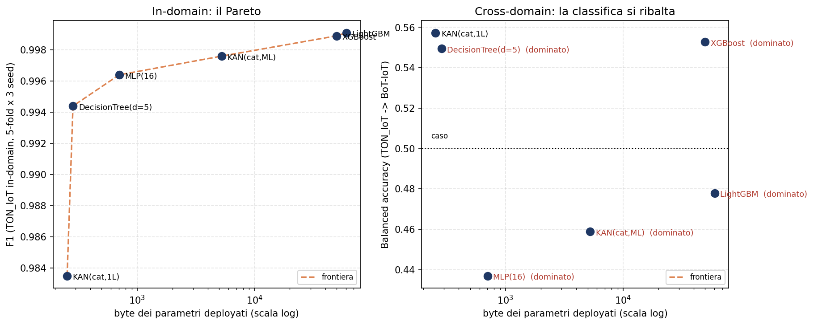

# KAN-IDS: Kolmogorov–Arnold Networks for Embedded Intrusion Detection

**Sub-kilobyte neural intrusion detection on microcontrollers — with integer-only inference, statistical guarantees, and a readable closed form.**

This repository extends the published pipeline of
[*Lightweight Machine Learning Intrusion Detection for IoT/IIoT Networks*](https://doi.org/10.3390/electronics15132869)
(De Bernardis, Kuznetsov, Arnesano, Zhansaya, Sydykova — *Electronics* 2026, 15, 2869)
with a fourth model family: **Kolmogorov–Arnold Networks (KAN)** compiled for
microcontroller deployment, building on the
[`lut-kan`](https://github.com/KuznetsovKarazin/lut-kan) quantisation framework.

All results below are measured on the full **TON_IoT** network dataset
(211,043 real flows), with every number backed by a script in `scripts/` and an
artifact in `results/`.

---

> **Protocol v2.0 — status.** The pipeline has been rebuilt to be
> **leakage-free end to end**: feature selection, categorical vocabularies and
> normalisation are now fitted **inside each training fold only**
> (`kanids/preprocessing.py`, enforced by `tests/test_leakage.py`).
> In protocol v1 the mutual-information ranking that picks the 10 numeric
> features was computed on a sample of the *whole* dataset before the split,
> so feature selection could see test labels. The numbers in the table below
> were produced under v1 and are **being regenerated under v2**; each one is
> republished only once `reproduce.py --stage cv-binary` / `cv-multiclass`
> has re-measured it with 5-fold × 3-seed cross-validation.
> `results/feature_selection_stability_*.csv` reports how often each feature
> survives per-fold selection, which bounds how much v1 and v2 can differ.

## Headline results

| Model | Accuracy (TON_IoT, held-out) | Deployed size | Arithmetic |
|---|---|---|---|
| Binary, single-layer + categorical edges | **F1 = 0.9837 ± 0.0007** (5-fold × 3-seed CV) | **254 B** | integer-only (int8 / Q15) |
| Binary, multi-layer (16 hidden) | **F1 = 0.9976 ± 0.0002** (5-fold × 3-seed CV) | **5.12 KB**, lossless (ΔF1 = 0.0000) | integer-only |
| Multiclass, 10 attack classes | macro-F1 = **0.9374 ± 0.0036** (5-fold × 3-seed CV) | 8.07 KB (inference) / **21.7 KB end-to-end** | integer-only, raw counters → decision |
| Symbolic form of the binary model | F1 = 0.9835 | a printable 10-term equation + 4 lookup tables | — |

> **Sizes are counted on the C headers that PlatformIO actually compiles**,
> not on an idealised packing: `scripts/c_footprint.py` sums the
> `static const` arrays of `mcu_pio/include/*.h`, and every figure above can
> be re-derived with `nm` on the object the compiler emits. Earlier versions
> of this table reported 246 B, 5.05 KB and 13.6 KB, produced by a counting
> rule the C code does not implement — see the size/accuracy section below,
> where the correction changes which model sits on the Pareto front.

For reference, the strongest neural baseline of the original paper — an MLP
via TensorFlow Lite Micro — reaches F1 = 0.9959 using **95 features and 13 KB**.
The multi-layer KAN here surpasses it (0.9974) using **14 features and 5 KB**.

> **Correction (protocol v2).** An earlier version of this table claimed that
> the 254-byte single-layer model outperforms tree ensembles "on the same
> deployable feature space". It does not. That comparison put the KAN on the
> raw 14-feature space and the baselines on the *derived* 10-feature unified
> space of the original paper — two different inputs. Re-run under v2 with
> **identical inputs for every model** (`scripts/cv_leakagefree.py`, 5-fold ×
> 3-seed), the binary ranking is:
>
> | Model | F1 | Precision | Recall | PR-AUC | FPR |
> |---|---|---|---|---|---|
> | LightGBM | **0.9991 ± 0.0001** | 0.9993 | 0.9990 | 1.0000 | 0.0023 |
> | XGBoost | 0.9989 ± 0.0001 | 0.9987 | 0.9990 | 1.0000 | 0.0041 |
> | **KAN multi-layer + categorical edges** | 0.9976 ± 0.0002 | 0.9988 | 0.9964 | 0.9999 | 0.0037 |
> | MLP (16) | 0.9964 ± 0.0009 | 0.9973 | 0.9956 | 0.9998 | 0.0088 |
> | Decision Tree (d=5) | 0.9944 ± 0.0004 | 0.9977 | 0.9913 | 0.9981 | 0.0075 |
> | KAN single-layer + categorical edges | 0.9835 ± 0.0007 | 0.9934 | 0.9738 | 0.9985 | 0.0208 |
>
> Paired over the 15 identical folds (t-test / Wilcoxon):
>
> | Comparison | ΔF1 | Folds won | p (t-test) |
> |---|---|---|---|
> | multi-layer KAN − single-layer KAN | **+0.0141** | 15/15 | 2.4e−20 |
> | multi-layer KAN − Decision Tree (d=5) | **+0.0031** | 15/15 | 3.9e−13 |
> | multi-layer KAN − LightGBM | **−0.0015** | 0/15 | 3.7e−14 |
> | single-layer KAN − Decision Tree (d=5) | **−0.0109** | 0/15 | 5.1e−18 |
>
> The KAN's own numbers reproduce (0.9835 vs 0.9837 previously reported;
> 0.9721 vs 0.9720 without categorical edges; multi-layer 0.9976 ± 0.0002 vs
> 0.9974 on a single split), so the *model* results stand — the *comparison*
> did not.
>
> The mechanism is structural. The single-layer KAN is a **generalised additive
> model**: a sum of univariate edge functions, unable by construction to
> represent the feature interactions that trees exploit here. The multi-layer
> KAN can, and recovers +0.0141 F1 — winning every one of the 15 folds — which
> is direct evidence that the single-layer gap is about *interactions*, not
> about capacity or optimisation.
>
> Two consequences for how this work should be framed:
>
> 1. **Against LightGBM the claim must be accuracy per byte, not accuracy.**
>    The residual gap is 0.0015 F1 (LightGBM wins 15/15, so it is real, not
>    noise), but 400 boosted trees do not fit an ATmega2560 at all, while the
>    multi-layer KAN runs in 5 KB with integer-only arithmetic.
> 2. **The depth-5 decision tree wins on accuracy in-domain**, by 0.0109 F1,
>    15/15 folds. It is **not** smaller: an earlier version of this line said
>    141 B against the KAN's 250 B and concluded the single-layer KAN was
>    dominated. Those two numbers came from different accounting — the 141 B
>    was an idealised packing, the C header `mcu_pio/include/dt5_model.h`
>    stores four parallel arrays over all 57 nodes and occupies **285 B**
>    against the KAN's **254 B**. Counted the same way, on the code that
>    ships, the KAN is the smaller model and the front is a genuine
>    trade-off, not a domination — see the size/accuracy section below.

---

## What is new, and why it matters

### 1. A 14-feature space that matches 95 features
Feature-count ablation (`scripts/feature_curve_driver.py`) originally reported
a peak at exactly **10 numeric features**. The nested cross-validation added in
protocol v2 (see below) shows this is not the case: accuracy rises monotonically
up to the full 16 candidates, and k = 10 costs 0.0009 F1. **k = 10 is a
deployment choice** — 10 flow statistics to compute on-device instead of 16 —
not an accuracy optimum. The missing multiclass information turns out to be
**categorical** (`proto`, `service`, `conn_state`, `dns_rejected`): LightGBM on
10 numeric + 4 categorical features reaches macro-F1 0.9675, statistically
indistinguishable from 0.9694 obtained with all 95 features in the original
paper. This cuts on-device feature-extraction cost ~7× for *any* model family.

### 2. Categorical edges for KANs (novel)
KANs have no native way to consume categorical inputs; one-hot encoding wastes
polynomial bases. We introduce **tabular categorical edges**:
φ(category) = a learned table row, trained jointly by backpropagation, indexed
by category ID at inference. In a LUT-compiled KAN this is *free* — a
categorical edge is already a lookup table (560 bytes for all four features).
Effect: multiclass macro-F1 climbs 0.858 → 0.875 (single layer)
→ **0.941** (with depth); binary F1 climbs 0.971 → **0.984**.

### 3. Hybrid compilation: train-Chebyshev, deploy-B-spline (novel)
Chebyshev bases train more accurately; B-splines quantise more faithfully
(10× lower logit error — local support, no oscillation). We get both by
**re-fitting the learned edge functions with cubic B-splines and storing the
quantised spline coefficients** (19 per edge) instead of a sampled LUT:

| Compilation | Size | ΔF1 | Agreement vs float |
|---|---|---|---|
| Sampled LUT, L = 64 (baseline) | 5,476 B | −0.0001 | 99.95 % |
| Spline coefficients, int16 | 500 B | **0.0000 (lossless)** | **100.000 %** |
| Spline coefficients, int8, full-integer | **250 B** | −0.0002 | 99.95 % |

Those are the sizes reported by the compilation script
(`results/kan14_compile_real.csv`), which counts the coefficients, the
categorical tables and the Q15 multipliers. The **deployed** header
`mcu_pio/include/kan14_coeff_int8.h` is **254 B**: it also stores the 4-byte
table of categorical offsets, which the script treats as derivable. 254 B is
the number used in the Pareto below, because it is what the compiler emits.

Uniform (unclamped) knots give a closed matrix form per segment, evaluated
with **integer-only Horner (Q15)** — no floating point at inference.

### 4. End-to-end integer pipeline: raw counters → decision

> **Status (protocol v2).** This is now implemented and verified **in C**, not
> only simulated in Python. `scripts/export_e2e_int_c.py` emits
> `mcu_pio/include/kan_e2e_int.h` (integer tables + 200 golden vectors) and
> `mcu_pio/host_check/run_e2e_check.cpp` runs the whole chain — raw counters →
> integer features → affine segment map → int8 spline kernel → decision — in
> pure integer arithmetic. Result: **200/200 logits bit-identical** to the
> Python reference (`kanids/integer.py`), decisions identical, **1,334 B** of
> tables (an earlier version said ~822 B, counting the natural-log LUT as
> `int16`; the header declares it `int32_t[256]`, i.e. 1,024 B on its own).
> Compiling the inference path and inspecting the assembly shows **zero
> floating-point instructions**; two tests fail the build if a `float` or
> `double` ever reappears in the header or the kernel.
>
> Two things were found while doing this. The scale multiplier of the
> highest-scale feature quantises to exactly 32768, which **overflows `int16_t`
> silently** — it is now `int32_t` (+20 B). And Python's integer division
> floors while C truncates toward zero: the two asymmetry features have signed
> numerators, so the C code implements floor division explicitly. Either bug
> would have appeared only on the device.
>
> **The 10-class chain is now in C as well.** `scripts/export_mc_e2e_int_c.py`
> emits `mcu_pio/include/kan_mc_e2e_int.h` and
> `mcu_pio/host_check/run_mc_e2e_check.cpp` runs raw counters → binary search
> over per-feature threshold tables → z in Q12 → layer-1 int8 splines +
> categorical tables → tanh LUT → layer-2 int8 splines → argmax, all in
> integers. Result: **200/200 golden vectors with all ten accumulators
> bit-identical** to the Python reference, argmax identical, macro-F1 0.9352
> against 0.9378 for the float pipeline (99.42 % argmax agreement), **21.7 KB**
> of tables. (An earlier version said 13.6 KB. The header stores the knots
> twice — `MC_KNOT` as `int64_t[1290]`, 10,320 B, plus `MC_KNOTZ` as
> `int16_t[1290]`, 2,580 B — and the earlier count included only one of the
> two. Storing both is what makes the binary search exact on the raw counters
> *and* cheap on the normalised ones; it costs 12.6 KB of the 21.7, and is the
> most obvious place to look if this variant ever has to shrink.)
>
> The same failure mode appeared a second time here: `round(tanh(x)·32768)`
> reaches exactly 32768 at the edges of the domain, overflowing `int16`. It is
> now saturated to 32767 **in the Python reference too** — saturating only on
> the device would have made reference and firmware differ by 1 LSB precisely
> on the saturated values. Q15 quantisation landing exactly on 2^15 is worth
> checking wherever it appears.
>
> Threshold tables are stored as `int64`: on TON_IoT `src_bytes` and
> `dst_bytes` reach 3.9·10⁹, past the `int32` limit. It is the byte counters
> that force 64 bits, not the duration.
>
> The earlier end-to-end path in `mcu_e2e/` is **superseded**: it interpolated
> 10,000 `QuantileTransformer` knots in **double precision**, so it was
> end-to-end in structure but not integer-only in the runtime. Kept for
> reference only.
>
> **The chain is now also deployed, not only verified.** `mcu_pio/src/main_e2e.cpp`
> is a firmware variant that takes the **raw counters** and runs the whole chain
> on the board — feature engineering included — under the paper's benchmark
> protocol (500 timed inferences, on-board statistics, SRAM). Every other
> firmware variant consumes vectors that were already normalised off-device;
> without this one the end-to-end chain would be proven correct but never
> actually run as *the* pipeline on the MCU. Build it with
> `pio run -e megaatmega2560_e2e` or `-e esp32c3_e2e`.
>
> Firmware and offline harness include the **same** kernel
> (`mcu_pio/include/kan_e2e_infer.h`), so what is verified bit-exactly is what
> runs on the board rather than a copy that can drift.
>
> *On "no floating point":* the check is on the compiled assembly of the
> inference path (`tools/check_no_float.sh`), and it excludes FP **arithmetic**
> and int↔float conversions. The compiler does emit `pxor`/`movups` to zero the
> integer accumulator arrays in bulk; those are SIMD data moves, not FPU
> operations, and do not imply a floating-point unit on the target.

Everything between the packet counters and the decision is integer:
logarithms via a 512 B LUT (using the identity `log1p(a/b) = ln(a+b) − ln(b)`),
integer divisions for asymmetry ratios, and the z-score/clip normalisation
**absorbed into the spline segment mapping** (two affine constants per
feature). For the multiclass model, sklearn's quantile-normal preprocessing is
replaced by **empirical per-feature threshold tables built offline from the
fitted transformer** (quantile knots + most-frequent values — exact on
discrete masses, 3 KB total). Verified end-to-end on all 42,209 test flows:
binary F1 0.9646 in ~842 B total; 10-class macro-F1 0.9384 (agreement 99.5 %)
in ~11.1 KB total.

### 5. Conformal prediction in under 1 KB
Split-conformal calibration (marginal and per-class/Mondrian) is applied
**to the deployed integer model**, so the coverage guarantee holds for what
actually runs on the MCU. Measured coverage under protocol v2:
**99.05 / 94.90 / 90.23 %** at targets 99 / 95 / 90 % (v1 reported
99.07 / 95.09 / 89.93 — unchanged within noise); 93.9 % of predictions are
decisive singletons at α = 0.01. On-device cost: **two float thresholds**. Uncertain flows
(two-class sets) can be escalated to a gateway — triage with a statistically
controlled error rate.

### 6. The IDS as one readable equation
Each learned edge is fitted with elementary primitives (sin, tanh, gaussian,
polynomials — weighted by the data density). The result is a 10-term printable
formula plus four small category tables, reaching **F1 0.9830** against 0.9831
for the network it approximates, with 98.47 % agreement — statistically
indistinguishable, not above it. (Protocol v1 measured 0.9835 vs 0.9832 and the
README claimed the symbolic form was *better*; re-measured under v2 the two are
simply equivalent, which is the honest and still useful claim.) See
`results/kan14_symbolic_real.txt`.

### 7. Rigour
The main results carry **5-fold × 3-seed cross-validation** (mean ± std),
and every design choice is backed by a measured alternative — see
[Negative results and design justifications](#negative-results-and-design-justifications)
below for the full list with numbers.

---

## Negative results and design justifications

Not everything we tried helped — and each null result settles a design
question that a careful reader (or reviewer) would otherwise raise. All are
measured on the full dataset, with artifacts in `results/`:

| Experiment | Result | What it settles |
|---|---|---|
| **B-spline as *training* basis** (`basis_comparison_unified_real.csv`) | F1 0.9383 vs 0.9672 for Chebyshev at equal parameter count (0.9279 with class-weighted loss — the gap is structural, not a loss artifact) | Why training uses Chebyshev, even though B-splines quantise 10× more faithfully — motivating the hybrid train/deploy split |
| **Re-fit → sampled LUT** (`protocol_v1/hybrid_compile_real.csv`) | Statistically identical to direct LUT at every resolution L (e.g. 94.54% vs 94.58% agreement at L=8) | Why the hybrid gain lives in *coefficient storage*, not in smoothing the LUT: uniform-grid sampling is the bottleneck, and re-fitting cannot remove it |
| **Doubling capacity (32 hidden units)** (`protocol_v1/ml_binary_real.csv`) | Plateau at F1 0.9778, below the 16-hidden result (0.9784), at 2× the parameters | Why the deployed multi-layer uses 16 hidden units; the bottleneck is input information, not model capacity |
| **More numeric features (k = 12–16)** (`protocol_v1/feature_curve_real.csv`) | F1 flat or slightly worse beyond k = 10, on both tasks | Why the feature space stops at 10 numeric features: additional ones add noise, not signal |
| **Lower layer-2 degree (4 vs 8)** (`protocol_v1/kan_ml_cat_deg4_real.csv`) | macro-F1 0.9374 vs 0.9409; LUT/coefficient memory does not depend on degree | Why degree 8 is kept: the cheaper variant saves nothing where it matters |
| **Focal loss (γ = 2) for the rare MITM class** (`protocol_v1/kan_ml_cat_focal_real.csv`) | macro-F1 0.9401 vs 0.9409; MITM F1 0.572 vs 0.571 | The MITM weakness is not a loss-design problem — **measured under protocol v1, not yet re-run under v2** |
| **SMOTENC oversampling (10× MITM)** (`protocol_v1/kan_ml_cat_smote_real.csv`) | macro-F1 0.9377; MITM F1 0.541 (worse than baseline) | Synthetic interpolation adds no real information — **protocol v1, not yet re-run under v2** |
| **MITM under every model** (`cv_leakagefree_summary_multiclass_real.csv`, v2) | LightGBM 0.767, XGBoost 0.761, MLP 0.386, KAN 0.270, Decision Tree 0.151 — every other class above 0.88 | **Independent v2 evidence for the same conclusion**: since even the most capable model stops at 0.77, the MITM ceiling is set by the information in the feature space, not by the architecture or the loss |
| **Analytical replication of sklearn's quantile-normal transform in integer arithmetic** | Two attempts (single-sided and two-sided quantile interpolation) left errors up to 0.8σ on discrete-mass features and broke the multiclass pipeline | Why the integer preprocessing uses **empirical per-feature threshold tables sampled offline from the fitted transformer** — exact on discrete masses by construction, 3 KB total |

Two further checks worth knowing about: the accelerated training path used
for large experiments is proven identical to the reference implementation to
machine precision (max coefficient difference 2·10⁻¹⁶ after 60 epochs), and
the focal-loss gradient was verified against numerical differentiation
(max error < 10⁻⁹) before use.

## Repository structure

```
kan-ids/
├── reproduce.py            single entry point: `python reproduce.py --list`
├── kanids/                 leakage-free core — the only place that learns from data
│   ├── config.py                   paths, seeds, feature space (single source of truth)
│   ├── preprocessing.py            fit-on-train feature selection + encoding + scaling
│   ├── splits.py                   5-fold × 3-seed protocol, shared by every model
│   ├── models.py                   KAN with categorical edges + baselines, one interface
│   ├── metrics.py                  F1/PR-AUC/confusion matrices, mean ± std aggregation
│   ├── datasets.py                 TON_IoT loader + synthetic generator for smoke tests
│   └── cache.py                    artifact cache with automatic invalidation
├── tests/                  leakage and reproducibility tests (pytest)
├── tools/                  maintenance scripts (e.g. /tmp → artifacts/ migration)
├── artifacts/              intermediate caches — regenerated, gitignored, never /tmp
├── src/                    KAN model implementations (NumPy)
│   ├── kan_chebyshev.py            single-layer Chebyshev KAN (binary)
│   ├── kan_chebyshev_multiclass.py softmax multiclass variant
│   ├── kan_bspline.py              B-spline KAN + basis utilities
│   ├── kan_multilayer_numpy.py     multi-layer forward (verification)
│   └── quantization_export.py, embedded_model_io.py, fixed_point_quantile.py
├── preprocessing/          unified 10-feature engineering (from the paper)
├── scripts/                every experiment, one script each (see index below)
├── results/                artefatti CSV/TXT che sostengono ogni numero sopra
│   └── protocol_v1/              risultati pre-correzione, conservati e marcati
├── mcu_pio/                PlatformIO firmware (Arduino Mega 2560 + ESP32-C3)
│   ├── src/main.cpp              variant 1–2: sampled-LUT inference benchmark
│   ├── src/main_coeff.cpp        variant 3: spline-coefficient full-integer
│   ├── include/                  model headers + 200 real test vectors
│   └── host_check/               offline g++ verification harness
├── models/                 trained model weights (.npz) — ready to compile/test
├── mcu/, mcu_e2e/          earlier firmware experiments (Wokwi, kept for reference)
├── data/                   dataset download instructions (data not redistributed)
└── utils.py                shared models/metrics (from the published pipeline)
```

### Script index

**Training** — `kan14_binary.py` (14-feature binary + categorical edges),
`kan14_ml_binary.py` (multi-layer binary), `kan_categorical_mc.py` /
`kan_ml_cat_mc.py` (multiclass with categorical edges), `cv_multiseed.py` +
`cv_driver.py` and `kan14_cv_driver.py` (cross-validation).

**Compilation & deployment** — `export_lut.py` / `export_lut_fast.py`
(sampled LUT), `hybrid_coeff_full.py` and `kan14_compile.py` /
`kan14_ml_compile.py` (spline-coefficient compilation, int16/int8),
`coeff_int_inference.py` (full-integer kernel), `e2e_int_pipeline.py` and
`kan14_mc_e2e_int.py` (end-to-end integer pipelines),
`export_kan14_coeff_c.py` (C header generation for the firmware).

**Analysis & ablations** — `feature_curve_driver.py`, `ablation_L.py`,
`basis_comparison_unified.py`, `quant_basis_comparison.py`,
`hybrid_compile.py`, `kan_ml_cat_focal.py`, `kan_ml_cat_smote.py`,
`kan_ml_cat_deg.py`, `conformal_ids.py` / `kan14_conformal_symbolic.py`,
`symbolic_extract.py`.

**Cross-domain & joint training** — `cross_domain.py` (four TON_IoT ↔
BoT-IoT experiments) and `crossdomain_report.py` (tables + shift analysis);
`joint_training.py` (TON_IoT + BoT-IoT trained together at matched
size/ratio, evaluated separately on each and, with `--eval-extra unsw`, on
UNSW-NB15 without retraining).

Long-running scripts (`*_driver.py`, `kan*_ml_*.py`) are **checkpointed**:
they save state after each unit/epoch chunk and can be re-invoked until they
print `DONE` — convenient on shared or time-limited machines.

---

## Getting started

```bash
git clone https://github.com/emanuelepiodebernardis/kan-ids-v2.git
cd kan-ids
pip install -r requirements.txt          # numpy, pandas, scikit-learn, scipy
pip install xgboost lightgbm imbalanced-learn   # optional: baselines, SMOTENC
git clone https://github.com/KuznetsovKarazin/lut-kan.git   # OPTIONAL: legacy LUT export scripts only
```

**Pre-trained models.** `models/` holds the versioned training checkpoints of
the headline models plus `feature_space.npz` and a `MANIFEST.json` recording
the protocol version, the seeds, the selected feature space and the measured
metrics (`scripts/export_models.py` regenerates it). The **deployable**
artifacts are the C headers in `mcu_pio/include/`, and those are what make the
next sentence true: you can compile and verify every host check **without the
dataset and without retraining**. The dataset is only needed to reproduce
training and the evaluation tables.

`artifacts/` and `models/` are not the same thing: `artifacts/` is regenerable
cache, gitignored, wiped by `reproduce.py --stage clean`; `models/` is
versioned. The multiclass multi-layer checkpoint is not committed (it is a
25 MB optimiser state); `MANIFEST.json` names the script that regenerates it.

**Dataset.** Download `train_test_network.csv` (TON_IoT, UNSW Canberra —
see `data/README.md`) and place it in the repository root. It is not
redistributed here.

**Reproduce:**

```bash
# 1. smoke test — no download needed, ~1 minute
#    runs the whole chain on synthetic data with the TON_IoT schema
#    and executes the leakage / reproducibility test suite
python reproduce.py --stage smoke

# 2. the real experiments (needs data/train_test_network.csv)
python reproduce.py --list          # what each stage does
python reproduce.py --stage cv-binary        # 5-fold × 3-seed, KAN + all baselines
python reproduce.py --stage cv-multiclass
python reproduce.py --stage all              # everything, in dependency order

python reproduce.py --stage clean            # wipe artifacts/ and start over
```

Every run prints the seeds, the library versions and the validation protocol
before doing anything, so an experiment log contains all that is needed to
repeat it. Individual scripts remain runnable on their own:

```bash
python scripts/cv_leakagefree.py --task binary --models KAN,LightGBM
python scripts/kan14_compile.py                   # 250 B full-integer (254 B nell'header C)
python scripts/c_footprint.py --verbose            # byte contati sugli header compilati
python scripts/kan14_mc_e2e_int.py                # raw counters → 10 classes
```

Intermediate caches and training checkpoints are written to `artifacts/`
inside the repository (override with `KANIDS_ARTIFACTS`). Nothing is written
to `/tmp`, so a clean clone behaves identically on Linux, macOS and Windows,
and a cache produced by an older pipeline version is detected and rebuilt
instead of being silently reused.

---

## Experimental protocol

One protocol for every model, so that the comparison table is a comparison
and not a collection of differently-measured numbers.

| Item | Choice | Why |
|---|---|---|
| Validation | `StratifiedKFold(5, shuffle=True)` repeated over **seeds 42, 43, 44** → 15 fits per model, reported as mean ± std | A single split cannot separate a real gap from fold noise; 3 seeds expose seed sensitivity |
| Stratification | always on the **10-class** label, even for the binary task | Binary and multiclass models then see byte-identical folds, and the rare MITM class is present in every fold |
| Feature selection | mutual information, computed **inside each training fold** | In v1 this ran once on a sample of the whole dataset — test labels leaked into the choice of features |
| Categorical encoding | vocabulary built from the **training fold**; index 0 reserved for unseen categories (UNK) | Fixes the v1 leak (vocabulary built on train+test) and makes the categorical edge a *total* function — required for cross-domain, where the target dataset has protocol/state values absent from the source |
| Numeric scaling | `log1p` on skewed features → `QuantileTransformer(normal)` → clip to ±3.5, **fitted on the training fold** | Unchanged from v1, which was already correct; now explicit and covered by tests |
| Held-out | 20 % stratified, never touched during selection or tuning | Only used for the final reported number |

Seeds live in `kanids/config.py` (`SEEDS = (42, 43, 44)`) and are printed by
every run. `kanids.set_global_seed()` fixes `random`, `numpy` and `torch`.

### How leakage-freedom is enforced

`kanids/preprocessing.py` has exactly one rule: `fit()` sees only the training
split, `transform()` never receives `y`. Four tests hold it in place:

| Test | What it would catch |
|---|---|
| `test_transform_is_row_independent` | any statistic recomputed inside `transform` (a re-fitted scaler, a rebuilt vocabulary) |
| `test_fit_depends_only_on_training_rows` | corrupting the test rows must not change the fitted preprocessor at all |
| `test_permuted_labels_give_chance_performance` | reproduces the v1 defect: with random labels, pre-split selection scores **AUC 0.521 ± 0.033**, per-fold selection stays at **0.499 ± 0.027** |
| `test_unseen_category_maps_to_unk` | an unseen category must land in the UNK slot, in range for the on-device table lookup |

`tests/test_reproducibility.py` additionally fails the build on any hard-coded
`/tmp` path, any absolute user path, unpinned requirements, or a missing
`reproduce.py` stage — the properties of point 6 are checked, not just claimed.

The measured effect of the v1 leak on a *real* dataset is expected to be small
(the ranking is stable: see `results/feature_selection_stability_*.csv`), but
"small" is a measurement, not an assumption, and the protocol has to be
defensible independently of how large the effect turns out to be.

---

## Is the reported estimate independent? A measurement, not an argument

Cross-validation is unbiased for a *fixed* pipeline. Ours was not fixed: the
number of numeric features (k = 10) was chosen by looking at results computed
on the same 211,043 flows, together with the hidden width, the Chebyshev
degree and the clip. That is precisely what "the final evaluation must remain
genuinely independent" targets, so it was measured rather than argued.

`scripts/nested_cv.py` runs a **nested cross-validation**: inside every outer
fold, an inner 3-fold CV on the outer *training* data alone picks k from
{5, 8, 10, 12, 14, 16}; the model is then refitted with that k and scored on
the outer validation fold, which took no part in the choice. The gap between
the nested estimate and the flat one **is** the selection optimism.

| Model | Nested (selection inside the loop) | Flat (k fixed at 10) | Optimism | k chosen by the inner CV |
|---|---|---|---|---|
| KAN single-layer | 0.9845 ± 0.0006 | 0.9835 | **−0.0009** | 16 in **15/15** folds |
| LightGBM | 0.9992 ± 0.0001 | 0.9991 | **−0.0001** | 16 in 11/15, 14 in 3, 12 in 1 |

**There is no optimism to correct: the optimism is negative.** The nested
estimate is *higher* than the reported one for both models, so the published
numbers are, if anything, slightly conservative. The reason is simple — the
flat protocol is locked to an inherited k = 10, while the nested procedure is
free to pick a better one.

**What the measurement does overturn is a different claim.** The inner
selection never picks k = 10; it picks the full set of 16 candidates in 15/15
folds for the KAN. The averaged inner curve is monotone, not peaked:

| k | 5 | 8 | 10 | 12 | 14 | 16 |
|---|---|---|---|---|---|---|
| KAN single-layer | 0.9795 | 0.9809 | 0.9836 | 0.9839 | 0.9841 | **0.9845** |
| LightGBM | 0.9984 | 0.9989 | 0.9990 | 0.9991 | 0.9991 | **0.9991** |

So the earlier statement that "accuracy peaks at exactly 10 numeric features"
does not survive the corrected protocol. Accuracy keeps creeping up with more
features; it simply stops mattering. **k = 10 is a deployment decision, not an
accuracy-optimal one**, and now it has a price tag: it costs **0.0009 F1** for
the KAN and **0.0001** for LightGBM, in exchange for computing 10 flow
statistics on the device instead of 16. That is the honest way to state it,
and it is a better argument than a peak that is not there.

Two caveats stated rather than hidden. The hidden width (16), the Chebyshev
degree (8) and the clip (±3.5) were *not* re-selected inside the loop — they
are inherited from the previous phase, and the supporting ablations live in
`results/protocol_v1/`. And a genuinely virgin held-out is no longer
obtainable for this phase: those choices were made while looking at data that
any set carved out today would have been part of. What can be said, and now is
said with a number, is that the effect of that exposure on the reported metric
is below one thousandth of an F1 point, in the conservative direction.

Reproduce with:

```bash
python scripts/nested_cv.py --task binary --models "KAN(cat,1L)|LightGBM"
```

---

## Multiclass (10 attack classes), 5-fold × 3 seed

Same protocol, same feature space, same folds as the binary task.

| Model | Macro-F1 | Weighted-F1 | Macro-P | Macro-R | PR-AUC | F1 MITM |
|---|---|---|---|---|---|---|
| LightGBM | **0.9680 ± 0.0021** | 0.9903 | 0.9589 | 0.9807 | 0.9850 | 0.767 |
| XGBoost | 0.9666 ± 0.0021 | 0.9893 | 0.9608 | 0.9737 | 0.9834 | 0.761 |
| **KAN multi-layer + cat** | **0.9374 ± 0.0036** | 0.9803 | 0.9246 | 0.9738 | 0.9629 | 0.541 |
| MLP (16) | 0.9182 ± 0.0107 | 0.9758 | 0.9253 | 0.9151 | 0.9373 | 0.386 |
| KAN single-layer + cat | 0.8767 ± 0.0014 | 0.9424 | 0.8759 | 0.9295 | 0.9106 | 0.270 |
| Decision Tree (d=5) | 0.7633 ± 0.0033 | 0.8245 | 0.7829 | 0.7864 | 0.7351 | 0.151 |

Paired over the 15 identical folds:

| Comparison | Δ Macro-F1 | Folds won | p |
|---|---|---|---|
| multi-layer − single-layer | **+0.0608** | 15/15 | 1.6e−19 |
| multi-layer − Decision Tree (d=5) | **+0.1741** | 15/15 | 5.0e−23 |
| multi-layer − MLP (16) | **+0.0192** | 14/15 | 1.1e−05 |
| multi-layer − LightGBM | **−0.0306** | 0/15 | 5.8e−15 |

Two things the 10-class task shows that the binary one hides:

1. **Depth matters four times more here.** The multi-layer KAN gains +0.0608 macro-F1
   over the single-layer, against +0.0141 F1 on the binary task. Separating attack
   *families* needs feature interactions far more than separating attack from normal
   does — which is the same structural argument, with a much larger effect size.
2. **The depth-5 tree collapses.** It was the most accurate model on the binary
   task (285 B, F1 0.9944); here it is last by a wide margin, 0.1741 macro-F1
   below the multi-layer KAN. Its in-domain advantage was specific to the binary
   problem and does not survive the harder task.

**MITM is the ceiling for everyone.** With 1,043 flows (0.49 %), every model bottoms
out on it — LightGBM 0.767, KAN multi-layer 0.541, MLP 0.386, KAN single-layer 0.270,
Decision Tree 0.151 — while every other class is above 0.88. Since even the strongest
model stops at 0.77, the limit is the information available in this feature space, not
the architecture or the loss. The multi-layer KAN doubles the single-layer's MITM F1
(0.541 vs 0.270), which is where most of its macro-F1 advantage comes from.

---

## Size/accuracy Pareto: what the 254-byte claim actually buys

Counting every model with the **same rule** settles the comparison the earlier
claim left open — but only if the rule is the one the code implements. It was
not. Until this revision `scripts/footprint.py` counted bytes under an
idealised packing (internal node = 4 B, leaf = 1 B), which the C tree does not
use: `mcu_pio/include/dt5_model.h` stores four parallel arrays over all 57
nodes, leaves included, and occupies 285 B rather than 141. The rule now reads
the headers PlatformIO compiles (`scripts/c_footprint.py`), and the correction
is not cosmetic: it **reverses the size ordering** of the two smallest models.

| Model | Bytes | Rule | F1 (TON_IoT, 5×3 CV) | Bal. acc. TON→BoT | Structure |
|---|---|---|---|---|---|
| **KAN single-layer + cat** | **254** | compiled | 0.9835 ± 0.0007 | **0.5632** | int8 spline coeffs + 4 tables |
| Decision Tree (d=5) | 285 | compiled | **0.9944 ± 0.0004** | 0.5466 | 4 arrays × 57 nodes |
| MLP (16) | 705 | *estimate* | 0.9964 ± 0.0009 | 0.4703 | 705 int8 parameters |
| KAN e2e integer (binary) | 1,334 | compiled | — | — | raw counters → decision, all tables |
| **KAN multi-layer + cat** | **5,244** | compiled | **0.9976 ± 0.0002** | — | int8, two spline layers |
| KAN multiclass (10 classes) | 8,268 | compiled | — | — | int8, two layers, 10 outputs |
| KAN LUT integer (default env) | 10,248 | compiled | — | — | int16 lookup table, 10 × 512 |
| KAN e2e integer (10 classes) | 22,264 | compiled | — | — | raw values → argmax, knots stored twice |
| XGBoost | 49,905 | *estimate* | 0.9989 ± 0.0001 | 0.5597 | 300 trees, 9,921 nodes |
| LightGBM | 60,400 | *estimate* | 0.9991 ± 0.0001 | 0.4815 | 400 trees, 12,000 nodes |

**The two rules are not interchangeable, and the table says which applies
where.** "Compiled" is a measurement: the sum of the `static const` arrays in
the header, reproducible with `nm` on the emitted object. "Estimate" is a
lower bound for the three models never exported to C — MLP, XGBoost, LightGBM
— so a model that appears to be beaten on size by an estimated row has not
been proven to be.

**In-domain the single-layer KAN is no longer dominated; it is the smallest
model on the front.** The depth-5 tree is still more accurate (0.9944 vs
0.9835) and is monotone-invariant, so it needs no preprocessing at all, and
the KAN's end-to-end integer chain costs 1,334 B once the feature engineering
is included. The front is a real trade-off across its whole range — 31 bytes
buys 0.011 F1 at the bottom, 49,600 bytes buys 0.0045 more at the top — rather
than a domination. What does **not** follow from this correction is that
"accuracy per byte" is vindicated: 31 bytes is a rounding error on either
board, and the argument the repository makes for the single-layer model still
rests on cross-domain behaviour, not on size.

Three things survive, and they are what the line of work should be built on:

1. **The multi-layer KAN sits on the frontier.** 5.2 KB and F1 0.9976, against
   the original paper's TensorFlow Lite Micro MLP at 13 KB and 0.9959 using 95
   features — smaller, more accurate, and 14 features instead of 95.
2. **Cross-domain the ranking inverts.** The single-layer KAN is the *best*
   transferring model (0.5632 balanced accuracy TON→BoT) while the depth-5 tree
   falls to 0.5466 and is the worst of all in the BoT→TON direction (0.4651);
   LightGBM, first in-domain, is last cross-domain. Under domain shift the
   additive model degrades most gracefully — that, not size, is where the
   architecture earns its place.
3. **The KAN offers what a tree does not**: split-conformal calibration applied
   to the deployed integer model, a closed symbolic form, and — because the
   whole model is rewritable lookup tables — the possibility of on-device
   recalibration, which is precisely the follow-up the cross-domain collapse
   motivates.



Not measured here: **latency**, which depends on toolchain and target and
requires the physical benchmark on the Mega 2560 and ESP32-C3.
`scripts/footprint.py` produces the size axis only.

**Code size and SRAM, however, are now measurable without the boards**, by
building the firmware with the AVR toolchain and reading `avr-size`. Doing so
found a defect the parameter count hides: `dt5_model.h`, `kan_e2e_int.h`,
`kan_mc_e2e_int.h` and `test_vectors.h` were declared without `PROGMEM`, so on
AVR their tables landed in **SRAM** instead of Flash — 6,286 B for the tree
firmware and 7,334 B for the end-to-end one, against the Mega 2560's 8 KB
total. Both would have failed on the bench, not in the table. See the firmware
section for the fix and the current figures.

---

## Cross-domain: TON_IoT ↔ BoT-IoT

Binary task (normal vs attack) on a **harmonised 13-feature space** built with
the *same formula* on both datasets (`kanids/harmonized.py`): flow duration,
IP-level bytes and packets per direction, their totals, asymmetries, mean
payloads and rates, plus protocol and connection state mapped into a common
semantic alphabet. Ports and addresses are excluded — they are testbed
identifiers — as are BoT-IoT's windowed aggregates, which have no TON_IoT
counterpart and assume global state an MCU does not keep.

In the cross-domain runs the target domain is used **only** for evaluation:
feature selection, quantiles, categorical vocabularies and thresholds are all
fitted on the source. Unseen target categories fall into the UNK slot, whose
rate is reported.

That constraint is **enforced by a test, not asserted in prose**
(`tests/test_leakage.py::test_crossdomain_target_does_not_influence_training`).
The pipeline is fitted twice on the same source with two radically different
targets — one rescaled by 5,000 and carrying categories that never occur in the
source — and the test requires that everything learned is byte-identical: the
selected features, the categorical vocabularies and cardinalities, the fitted
quantiles, and the transform of a third fixed probe set. Injecting the classic
violation (fitting the preprocessor on source ∪ target) makes it fail, which is
how we know it is not vacuous.

| Experiment | Train | Test | Runs |
|---|---|---|---|
| training and test on TON_IoT | 168,834 | 42,209 | 15 per model |
| training and test on BoT-IoT | 19,431–19,482 | 733,704–733,705 | 50 per model |
| training on TON_IoT, test on BoT-IoT | 211,043 (all) | 3,668,522 (all) | 10 seeds |
| training on BoT-IoT, test on TON_IoT | 24,327 | 211,043 (all) | 10 seeds |

The two cross directions consume the target whole, so there are no folds there
by construction and the dispersion reported is between seeds. The in-domain
BoT-IoT and both cross directions were rerun at 10 seeds (up from 3) to close
a gap flagged during an internal audit: the cross-domain claims were resting
on 3 repetitions against 15 for in-domain, and a follow-up project working on
domain adaptation on the same data (`adattamento-drift/`, see below) had
already shown that 3-seed samples on these exact directions can mislead. The
in-domain TON_IoT reference is unchanged at 3 seeds × 5 folds = 15, which was
never flagged and is left as is.

**Metric note.** BoT-IoT is 99.987 % attack. Under that prior PR-AUC on the
positive class is ~1 by construction and says nothing: the TON→BoT runs show
PR-AUC 0.9999 while the models are at chance. The honest metrics are the two
per-class recalls and their mean (balanced accuracy), reported below.

### Balanced accuracy (mean of the two per-class recalls; 0.50 = chance)

| Model | TON in-domain | TON→BoT | δ | BoT in-domain | BoT→TON | δ |
|---|---|---|---|---|---|---|
| **KAN multi-layer** | 0.9933 | 0.4588 | 0.534 | 0.9971 | 0.6855 | 0.312 |
| **MLP (16)** | 0.9885 | **0.4369** | **0.552** | 0.9426 | 0.7343 | 0.208 |
| LightGBM | 0.9962 | 0.4779 | 0.518 | 0.9971 | 0.6964 | 0.301 |
| XGBoost | 0.9948 | 0.5528 | 0.442 | 0.9779 | 0.6487 | 0.329 |
| Decision Tree (d=5) | 0.9828 | 0.5494 | 0.433 | 0.9952 | 0.4597 | **0.536** |
| **KAN single-layer** | 0.9700 | **0.5573** | **0.413** | 0.9934 | 0.6112 | 0.382 |

All four experiments now use the same 10-seed protocol for the cross
directions (15 fits for the two in-domain references, unchanged; see the
table above for exact run counts).

Three things worth stating plainly, and one correction from the 3-seed table
this replaces:

1. **The collapse is near-total, not a degradation. This still holds.**
   TON→BoT leaves every model between 0.44 and 0.56 balanced accuracy — at or
   barely above chance. An order of magnitude worse than the δ ≤ 5.95 points
   quantified in the original paper.
2. **Correction: at 3 seeds the multi-layer KAN looked like the worst
   cross-domain performer and the biggest loser (0.4026, δ=0.591); at 10 seeds
   it is not — MLP (16) is, on both counts (0.4369, δ=0.552).** The
   multi-layer KAN is still a large loser (δ=0.534) and the qualitative
   pattern the original claim rested on — capacity bought in-domain costs
   transfer — still holds and is if anything sharper with the correction: two
   different architecture families (a deeper KAN, a wider MLP) both convert
   in-domain capacity into cross-domain loss, so it is not an artifact of the
   KAN family specifically. What does not survive is the specific ranking
   ("the worst of every model tested"), which was resting on 3 points per
   model. **The single-layer KAN remains the best cross-domain performer and
   the smallest loser in this direction** (0.5573, δ=0.413) at 10 seeds too.
   LightGBM keeps the same top-in/poor-cross pattern (0.9962 → 0.4779).
3. **BoT→TON is unstable, not just degraded — confirmed and sharper.** The
   single-layer KAN's F1 has mean 0.463 with std **0.141** across the 10
   seeds (`results/crossdomain_runs_cat.csv`) — the widest dispersion of any
   cell in this table other than KAN multi-layer's own 0.140. The normal
   class (477 examples) is effectively undetermined by the available data.
   **New at 10 seeds:** Decision Tree (d=5) is the actual worst performer in
   this direction, and consistently so (F1 mean 0.162, std 0.033 — low
   variance, not instability): a shallow tree fit on 24,327 rows finds a rule
   that transfers worse than any other model here, reliably.

### Why it degrades

The marginals barely overlap. Per-feature histogram overlap between the two
domains (0 = disjoint, 1 = identical), `results/crossdomain_shift.csv`:

| Feature | median TON | median BoT | overlap |
|---|---|---|---|
| byte_rate | 544 217.7 | 32.4 | **0.085** |
| duration | 0.000 | 15.509 | **0.106** |
| bytes_total | 172 | 600 | 0.153 |
| pkt_asymmetry | 0.000 | 0.857 | 0.162 |
| flow_rate | 7 978.7 | 0.404 | 0.178 |

TON_IoT flows are short and bidirectional; BoT-IoT's 5 % subset is dominated by
long unidirectional UDP floods (`pkts_dst` median 0, `byte_asymmetry` 0.998).
The connection state confirms it: BoT-IoT is 78 % `incomplete` + 21 % `reset`,
TON_IoT spreads across all six states. 21.3 % of TON_IoT rows carry a state
never seen when training on BoT-IoT; in the other direction the rate is ~0.

The harmonised categorical edges are what keeps the transfer above chance:
removing them costs 0.08–0.16 balanced accuracy cross-domain
(`results/crossdomain_table.csv`, variant `nocat`), confirming that the
semantic state mapping carries real transferable information.

Reproduce with:

```bash
python scripts/cross_domain.py --exp all          # 4 experiments
python scripts/cross_domain.py --exp all --no-cat # numeric-only ablation
python scripts/crossdomain_report.py              # tables + shift analysis
```

---

## Joint training: TON_IoT + BoT-IoT together, tested on a third domain

Cross-domain shows what happens training on one domain and testing on
another. The complementary question is what happens training on **both at
once**, with matched contribution from each — and whether whatever it learns
survives contact with a domain it has never seen at all.

### The constraint that limits everything here

The request was a joint training set with the same total size and, as far as
possible, the same normal/attack ratio contributed by each domain. Both
constraints together are bounded by BoT-IoT: 477 normal flows total, ~382 of
them inside its own 80% training split — three orders of magnitude fewer than
TON_IoT's ~40,000. `balance_joint()` (`scripts/joint_training.py`) enforces
this: it splits train/test **inside each domain first**, then caps both
domains' normal count at the smaller of the two (always BoT-IoT's), then caps
attacks at `ratio × normals` in both, **then** concatenates — feature
selection, preprocessing and model fitting only ever see the union. This
order is enforced by a test
(`tests/test_joint_training.py::test_joint_training_test_set_does_not_influence_training`),
built the same way as the cross-domain one: fit the same joint training set
twice against radically different held-out test pairs and require the
learned preprocessor to be byte-identical.

### Choosing the ratio: a first guess, then data

`--ratio 50` was the project's standing convention going in, and was tested
first as the natural default, together with 1:20 and 1:100 as sensitivity.
Across those three, three of the six models (LightGBM, XGBoost, MLP) got
measurably **worse** as the ratio grew — paired t-tests across 10 seeds, e.g.
LightGBM on TON_test: 0.9816 (1:20) → 0.9794 (1:50) → 0.9776 (1:100), t=3.57,
p=0.006. That ruled out 1:50 as the default: the grid was extended down to
1:10 and 1:5. The trend continued all the way to the floor tested — 1:5 beats
1:20 in 10 of 12 (model, test-domain) cells (paired t-test across the 10
seeds), significantly in four (TON_test: LightGBM p=0.0001, XGBoost p<0.0001,
MLP p<0.0001; BoT_test: XGBoost p=0.0066), and the two cells where 1:20
"wins" are −0.0013 (BoT_test, KAN single-layer) and −0.0019 (BoT_test, MLP),
neither significant (p=0.25, p=0.57). **1:5 is the
configuration used from here on**, not 1:50: keeping a number because it was
already the convention, once the data says otherwise, is exactly the kind of
unexamined default this project tries not to have.

Two things about that grid need to be stated, not left implicit:

- **The ratio confounds two variables.** Normals are pinned at ~382 in every
  cell; only the attack count changes, so a lower ratio means a training set
  that is *both* more balanced *and* smaller (1:5 → 2,292 rows/domain; 1:100
  → 38,582). The result — lower ratio wins — cannot distinguish "balance
  matters" from "size matters" by itself.
- **A result that does not need that distinction to be interesting: smaller
  wins anyway.** 1:5's training set is ~17× smaller than 1:100's and still
  matches or beats it on every model. For this joint-training setup, balance
  dominates volume, not the other way around.
- **MLP (16) is the least reliable model in this grid**, not just the most
  ratio-sensitive: its seed-to-seed std on TON_test ranges 0.0061–0.0476
  across the five ratios tested; every other model stays within 0.0011–0.0082
  over the same grid, so at its worst (ratio 50) MLP's dispersion is ~5.8×
  the widest value any other model reaches. Read its numbers with that
  reservation; they are not as trustworthy as the other five models' at the
  same seed count.
- **The floor was not pushed to 1:1.** At 1:1 each domain's training
  contribution would be ~764 rows, and this exact regime — BoT-IoT-derived
  extreme rebalancing — is where a companion project working the same data
  (`adattamento-drift/`, see below) already documented a **different** failure
  mode: label selection for adaptation becomes unreliable before the model
  itself does. 1:5 is reported as the best point *measured*, not as a proven
  optimum; the true optimum may sit below it.

Full grid, checkpoints and the balance/ratio corrections above are in
`results/joint_training_*_ratio{5,10,20,50,100}_cat.csv`.

### Generalization to UNSW-NB15, frozen, no retraining

The joint model (features, preprocessing, architecture and hyperparameters,
all frozen at fit time) is evaluated on UNSW-NB15 exactly as fitted — same
call, one more test dataframe, never touched by training, selection or
balancing (`--eval-extra unsw` in `scripts/joint_training.py`).

**Before reading that number: UNSW-NB15 has a ceiling in this feature space,
independent of any transfer.** Trained and tested only on itself, in the same
13+2-feature harmonised space, it reaches **0.8184 in-domain**
(`adattamento-drift/RISULTATI.md`, section 11) — because its discriminative
power lives largely in 38 features this space excludes by construction (the
same exclusions applied to TON_IoT/BoT-IoT, for the same reasons). No
TON+BoT→UNSW result can exceed 0.8184 in this space; a number well below it is
the target domain's ceiling showing through, not proof the joint model
learned nothing.

### The final table, one protocol throughout

| Model | TON→TON | BoT→BoT | TON→BoT | BoT→TON | TON+BoT→TON | TON+BoT→BoT | TON+BoT→UNSW |
|---|---|---|---|---|---|---|---|
| LightGBM | 0.9962 | 0.9971 | 0.4779 | 0.6964 | 0.9846 | 0.9951 | 0.3884 |
| XGBoost | 0.9948 | 0.9779 | 0.5528 | 0.6487 | 0.9804 | 0.9925 | 0.4193 |
| KAN multi-layer | 0.9933 | 0.9971 | 0.4588 | 0.6855 | 0.9811 | 0.9924 | 0.3629 |
| Decision Tree (d=5) | 0.9828 | 0.9952 | 0.5494 | 0.4597 | 0.9669 | 0.9865 | 0.4081 |
| MLP (16) | 0.9885 | 0.9426 | 0.4369 | 0.7343 | 0.9296 | 0.9494 | 0.3119 |
| KAN single-layer | 0.9700 | 0.9934 | 0.5573 | 0.6112 | 0.9432 | 0.9825 | 0.3991 |

All entries are balanced accuracy. TON→TON is the one column still at the
original 3 seeds × 5 folds (15 fits) — never flagged as needing a rerun, so
left as is; BoT→BoT, TON→BoT and BoT→TON are 10 seeds (this session's
rerun, see above); the three joint columns are 10 seeds at the ratio-5
configuration chosen above. Reading it in order:

- **Joint training roughly matches single-domain in-domain performance on
  both domains it was trained on, and even improves it for two models on
  one domain.** TON+BoT→TON costs 0.012–0.059 balanced accuracy versus
  TON→TON (worst case MLP, best case LightGBM/KAN multi-layer); on BoT,
  TON+BoT→BoT costs at most 0.011 (KAN single-layer) and **improves on
  BoT→BoT for two models** — XGBoost by 0.015, MLP by 0.007. Pooling the two
  training sets at matched size/ratio does not cost much on either domain
  for any of the six models, and for a third of them it is a net win on BoT.
- **TON+BoT→UNSW sits at 0.31–0.42 — well under the 0.8184 ceiling, and
  below the entire range of the pairwise cross-domain numbers** (0.44–0.73):
  a domain the joint model never saw any part of transfers worse than one
  domain transferring to the other. Some of that gap is the ceiling itself
  (0.8184 versus ~0.97–0.99 in-domain for TON_IoT/BoT-IoT), but not all of
  it — even scaled by the ceiling, UNSW is the hardest target in this table.
- Cross-domain rankings among the six models are **not** preserved in the
  joint-training columns: Decision Tree is the worst BoT→TON performer
  (0.4597) but the second-best TON+BoT→UNSW performer (0.4081, behind only
  XGBoost). Joint training and cross-domain transfer are different regimes
  and one does not predict the other from this table alone.

Reproduce with:

```bash
python scripts/joint_training.py --ratio 5                    # main config
python scripts/joint_training.py --ratio 5 --eval-extra unsw   # + UNSW-NB15
python scripts/joint_training.py --ratio 10   # sensitivity, also 20/50/100
```

---

## A fourth dataset, in a smaller space: CIC-IoT-2023

Requested by name. CIC-IoT-2023 does not report directional counts — no
`src_bytes`/`dst_bytes`, no `src_pkts`/`dst_pkts`, no connection state — so
seven of the thirteen rich-space numeric features (both asymmetries, both
mean payloads, all four directional counts) cannot be built for it. What
survives in all four datasets is six numeric features (duration, total
bytes, total packets, mean payload, flow rate, byte rate) plus the same two
categorical edges: a **6+2** space, not the 3+2 an earlier pass through this
data mistakenly concluded — that mistake mattered, because it also flagged
`flow_duration` as unusable, and `test.csv` (the file actually used here)
has a genuine one: median 26.1 s for benign flows against 0.0 s for attacks,
correlation with the (separately corrupted) `IAT` column of 0.008. `Duration`
is the TTL and is not used; `flow_duration` is not `Duration`.

**Verified, not assumed, that no missing feature is filled with an invented
value.** `build_ridotto_cic()` (`kanids/harmonized.py`) raises `KeyError` if
`flow_duration`, `Number` or `Tot sum` are absent rather than defaulting —
confirmed by running it against the actual file: all three are present, and
so are the TCP flag columns (`rst_count`, `fin_count`, `syn_count`,
`ack_count`) used to reconstruct connection state. Loaded whole, `test.csv`
gives a non-degenerate `state_h` (44% incomplete, 42% reset, 8% other, 6%
closed) and `proto_h` (67% TCP, 16% UDP, 11% ICMP, 6% other) — if the flag
columns had been absent, the fallback path would have collapsed `state_h` to
100% "incomplete", which is not what is observed.

### The cost of the reduction — measured on domains that don't need it

The same TON_IoT+BoT-IoT joint model (ratio 1:5, 10 seeds) was refit in the
6+2 space and re-evaluated on TON_test, BoT_test and UNSW-NB15, so the
reduction's cost is measured on the three domains already analysed in the
rich space, isolating what the reduction itself does:

| Model | Δ TON (rich−reduced) | p | Δ BoT | p | Δ UNSW | p |
|---|---|---|---|---|---|---|
| KAN single-layer | **−0.0054** | **<0.0001** | +0.0021 | 0.395 | **−0.0755** | **<0.0001** |
| KAN multi-layer | +0.0008 | 0.343 | −0.0026 | 0.244 | **−0.0592** | **0.0006** |
| LightGBM | **+0.0027** | **0.0006** | −0.0010 | 0.343 | **−0.0590** | **0.0489** |
| XGBoost | +0.0011 | 0.193 | 0.0000 | 0.995 | −0.0302 | 0.208 |
| Decision Tree (d=5) | 0.0000 | 0.995 | −0.0062 | 0.112 | −0.0286 | 0.146 |
| MLP (16) | **+0.0361** | **0.0273** | +0.0037 | 0.255 | +0.0029 | 0.435 |

Positive means the rich space wins; p is a paired t-test across the 10
seeds. **On BoT_test the reduction costs nothing distinguishable from noise
for any model** (all p>0.11). **On UNSW it wins significantly for three of
six models** (KAN single-layer, KAN multi-layer, LightGBM; p from <0.0001 to
0.049) **and loses significantly for none** — weaker than "wins for five of
six" (a sign count, not a test — an earlier draft of this section made
exactly that mistake, the third time in this line of work that a sign count
got reported where a test was needed) but still the opposite of what
"reduction costs generalization" predicted, for the three models where the
result is distinguishable from noise. **On TON_test the direction is not
uniform**: KAN single-layer significantly prefers the *reduced* space
(p<0.0001) while LightGBM and MLP significantly prefer the *rich* one
(p=0.0006, p=0.027) — three-way split, not "free either way." All TON deltas
are small (≤0.036) so "the cost is negligible" still holds; "the same for
every model" does not, and which space a given model prefers is not
predictable from the UNSW result for that same model (LightGBM prefers rich
on TON but reduced on UNSW). A plausible reading of the UNSW result specifically:
five of the seven dropped features are directional (asymmetries,
per-direction payload and counts), and directional statistics are exactly
what a capture setup can make look different across domains without the
traffic itself being different — dropping them may remove testbed-specific
signal along with genuine signal. This is a hypothesis the data here does
not distinguish from a smaller, noisier feature set transferring better for
unrelated reasons; it is reported as an observation, not a mechanism.

### CIC-IoT-2023 itself

| Model | Balanced accuracy |
|---|---|
| XGBoost | 0.5099 |
| KAN multi-layer | 0.5002 |
| LightGBM | 0.4928 |
| KAN single-layer | 0.4974 |
| MLP (16) | 0.4725 |
| Decision Tree (d=5) | 0.4144 |

Near chance for every model, and in the same range as TON+BoT→UNSW
re-measured in this same reduced space (0.31–0.47) — the two hardest targets
in this document sit close together once both are looked at in the same
6+2 space, below most of the pairwise TON↔BoT cross-domain numbers (0.44–0.73)
but not all of them (the worst pairwise cell, MLP on TON→BoT at 0.4369, falls
inside CIC's own range). This is not a contradiction of the companion project's
finding that CIC-IoT-2023 "is not a severe transfer benchmark" — that finding
was about single-domain cross-domain transfer *into* CIC-IoT-2023, in a
different space, with adaptation. Zero-shot from a joint TON+BoT model,
un-adapted, is a different question, and the answer here is that it
transfers poorly. The two results are about different pipelines and are not
in tension.

CIC-IoT-2023's rows are also a different unit of observation from the other
three datasets — sliding windows of packets, not bidirectional flows — which
this space does not correct for and which is a more likely explanation for
the near-chance result than the feature reduction itself (whose measured
cost, above, is small or favorable).

Reproduce with:

```bash
python scripts/joint_training.py --ratio 5 --spazio ridotto --eval-extra unsw,cic
```

---

## A companion project: adaptation to domain drift

`adattamento-drift/` is a separate, self-contained project living at the
repository root, built on the same TON_IoT/BoT-IoT/UNSW-NB15 harmonised
feature space as the cross-domain work above but developed and reported
independently (its own `kanids/`, `scripts/`, `RISULTATI.md`, README). It
asks the question this cross-domain section's degradation implies: *given
that a model trained on one domain fails on another, can it be adapted back
to usable accuracy with a small, embedded-feasible label budget?* It is not
integrated into `reproduce.py` or this README's tables, and is not required
to reproduce anything above — see `adattamento-drift/README.md` for what it
contains and how to run it.

---

## What can actually be flashed

Every exported model has a firmware and a PlatformIO environment, so each one
can be measured on the two boards under the same benchmark protocol:

| Model | Firmware | Environment | Input |
|---|---|---|---|
| KAN LUT integer | `main.cpp` | `megaatmega2560`, `esp32c3` | pre-normalised vectors |
| KAN single-layer, spline coeffs | `main_coeff.cpp` | `*_coeff` | pre-normalised vectors |
| KAN multi-layer | `main_mlcoeff.cpp` | `*_mlcoeff` | pre-normalised vectors |
| KAN multiclass | `main_mc.cpp` | `esp32c3_mc` | pre-normalised vectors |
| **KAN end-to-end, binary** | `main_e2e.cpp` | `*_e2e` | **raw counters** |
| **KAN end-to-end, 10 classes** | `main_mc_e2e.cpp` | `esp32c3_mc_e2e` | **raw values** |
| **Decision Tree d=5** | `main_dt5.cpp` | `*_dt5` | same feature space as the KAN |

The last one exists for a specific reason: the depth-5 tree is the model that
most threatens the premise of this work, being more accurate in-domain than the
compiled single-layer KAN, and without a firmware that comparison could not be
closed on the device. On parameter bytes it occupies 285 B against the KAN's
254 B — the two are within 12 % of each other, so the tree's case rests on
accuracy, not on size. Quantising its thresholds to Q7 for the device costs it
0.0028 F1 (0.9944 → 0.9916, 99.55 % agreement with the float model), which
narrows the gap to the compiled KAN from 0.0109 to 0.0081 — still in the
tree's favour.

---

## Firmware

`mcu_pio/` is a PlatformIO project targeting the two boards of the original
paper — **Arduino Mega 2560** (AVR, 8 KB SRAM) and **ESP32-C3** (RISC-V) —
implementing the same benchmark protocol (500 timed inferences: 250 attack +
250 normal, on-board statistics, prediction verification, SRAM report,
CSV over serial):

```bash
cd mcu_pio
pio run -e megaatmega2560 -t upload           # variant 1-2: LUT inference
pio run -e megaatmega2560_coeff -t upload     # variant 3: 254 B binary (F1 0.983)
pio run -e megaatmega2560_mlcoeff -t upload   # variant 4: 5 KB multi-layer (F1 0.9974)
pio run -e esp32c3_mc -t upload               # variant 5: 8 KB multiclass (macro-F1 0.941)
pio device monitor --baud 115200
```

All five variants embed **real test vectors with expected predictions** from
the bit-exact reference simulation, so on-board correctness is verified
automatically at every run.

Without hardware, the exact inference kernels can be verified on any host:

```bash
cd mcu_pio
g++ -O2 -o c1 host_check/run_host_check.cpp     && ./c1   # LUT variant
g++ -O2 -o c2 host_check/run_coeff_check.cpp    && ./c2   # binary 254 B: 200/200
g++ -O2 -o c3 host_check/run_ml_coeff_check.cpp && ./c3   # multi-layer:  200/200
g++ -O2 -o c4 host_check/run_mc_coeff_check.cpp && ./c4   # multiclass:   200/200
```

The C kernel in `include/kan14_coeff_infer.h` is a line-by-line translation of
the bit-exact NumPy integer simulation and matches it on 200/200 real test
vectors. An optional INA219 hook (`-DENABLE_INA219`) measures energy per
inference.

### Flash and SRAM per variant, measured without the boards

PlatformIO needs to download its toolchains; `avr-gcc` alone does not, and it
is enough to compile each variant for the ATmega2560 and read the segment
sizes. This closes the part of the deployment question that does not need
hardware — only latency and energy do:

```bash
avr-g++ -mmcu=atmega2560 -Os -std=c++11 -DF_CPU=16000000UL \
        -Iinclude src/main_coeff.cpp -o /tmp/fw.elf
avr-size /tmp/fw.elf      # text = Flash, data + bss = SRAM (8,192 B available)
```

Doing this found a defect that the parameter count cannot show. Four headers —
`dt5_model.h`, `kan_e2e_int.h`, `kan_mc_e2e_int.h` and `test_vectors.h` — had
no `PROGMEM` qualifier, so on AVR their tables were emitted into `.data`, i.e.
**SRAM**, instead of Flash:

| Environment | Flash after | SRAM before | SRAM after | of 8 KB |
|---|---|---|---|---|
| `megaatmega2560` (LUT) | 14,220 B | 1,762 B | 82 B | 21.5 % → **1.0 %** |
| `megaatmega2560_coeff` | 7,402 B | 4 B | 4 B | 0.05 % |
| `megaatmega2560_mlcoeff` | 13,364 B | 4 B | 4 B | 0.05 % |
| `megaatmega2560_dt5` | 6,880 B | **6,286 B** | **0 B** | 76.7 % → **0 %** |
| `megaatmega2560_e2e` | 12,942 B | **7,334 B** | **0 B** | 89.5 % → **0 %** |

The two variants that were already `PROGMEM`-correct (`_coeff`, `_mlcoeff`)
used 4 bytes of SRAM and are unchanged. The other three did not fit: `_e2e` at
89.5 % of the Mega 2560's total SRAM leaves nothing for the stack and would
have failed at the first run on the bench, silently and in a way that looks
like a hardware fault rather than a software one. Moving the tables to Flash
trades SRAM for Flash — the tree firmware goes from 548 B to 6,880 B of Flash,
free on a 256 KB part.

`esp32c3_mc_e2e` has no AVR counterpart and cannot have one: its 200 golden
vectors are ~35 KB as a single object, past the AVR 32 KB per-object limit.
That was already true before this change; `platformio.ini` defines the
environment for the ESP32-C3 only, and the host check covers its correctness.

The lesson generalises past this repository: *bytes of parameters* and *bytes
of SRAM* are different quantities, and a size table that reports only the first
can pass review while the firmware cannot boot.

---

## Results index

Every claim maps to an artifact in `results/` (`*_real.csv` = full-dataset
runs). Highlights: `kan14_cv_summary_real.csv` (CV), `kan14_compile_real.csv`
and `kan14_ml_compile_real.csv` (compilations), `kan14_mc_e2e_int_real.csv`
(end-to-end multiclass), `kan14_conformal_real.csv`,
`kan14_symbolic_real.txt`, `ablation_L_real.csv`, `protocol_v1/feature_curve_real.csv`,
`quant_basis_comparison_real.csv`, `cv_multiseed_summary_real.csv`
(unified-10 baseline space). Joint training and its UNSW-NB15 generalization:
`joint_training_{runs,summary,balance}_ratio{5,10,20,50,100}_cat.csv` and
`confusion_joint_ratio5_cat_{ton,bot,unsw}_*.csv`.

**Known limitations.** The MITM class (208 test samples) stays at F1 ≈ 0.57:
three independent remedies (class weighting, focal loss, SMOTENC) show the
limit is informational, not methodological. Cross-dataset evaluation
(CIC-IoT-2023) is restricted to the 10 harmonised numeric features — the
categorical features that boost in-domain accuracy are capture-tool specific.
Physical latency/energy benchmarks require the boards and are the next step.

---

## Credits & citation

- LUT quantisation framework: [`lut-kan`](https://github.com/KuznetsovKarazin/lut-kan) (O. Kuznetsov) — see also arXiv:2601.03332 and arXiv:2601.08044.
- Baseline pipeline, preprocessing and reference models: [`iot-audit`](https://github.com/emanuelepiodebernardis/iot-audit).
- Dataset: TON_IoT, Moustafa et al., UNSW Canberra (CC BY 4.0).

If you use this work, please cite:

> De Bernardis, E.P.; Kuznetsov, O.; Arnesano, M.; Zhansaya, P.; Sydykova, M.
> *Lightweight Machine Learning Intrusion Detection for IoT/IIoT Networks:
> Quantisation Strategies and Physical Deployment on Resource-Constrained
> Microcontrollers.* Electronics 2026, 15, 2869.

License: MIT (see `LICENSE`).

